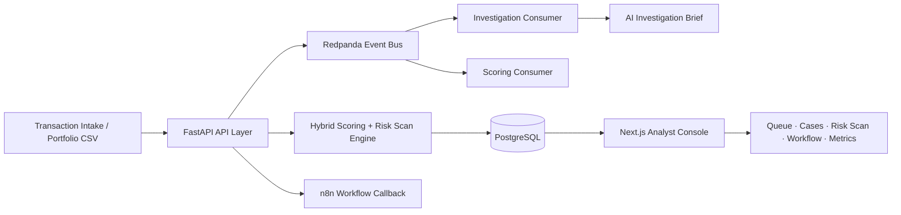

# Real-Time Fraud Intelligence Console

A local production-style fraud decisioning and analyst workflow platform for portfolio-scale
transaction risk scanning, case triage, AI-assisted investigation, workflow auditability,
and reliability monitoring.


---

## Demo and Walkthrough

| Surface | Access |
|---|---|
| Frontend Console | http://localhost:3000 |
| 10M Risk Scan Demo | http://localhost:3000/risk-scan?scan_id=aa0971d2-bdb6-49c7-bac3-fa355aa161ad |
| Backend Health | http://localhost:8000/health |
| Demo Video Pipeline | [fraud-console/demo/README.md](fraud-console/demo/README.md) |
| Demo Storyboard | [docs/DEMO_STORYBOARD.md](docs/DEMO_STORYBOARD.md) |
| Portfolio Case Study | [docs/PORTFOLIO_CASE_STUDY.md](docs/PORTFOLIO_CASE_STUDY.md) |

**Recommended demo flow:**
Overview &rarr; Dashboard &rarr; 10M Portfolio Risk Scan &rarr; Risk-Tier Filtering &rarr; Paginated Review &rarr; Review Queue &rarr; Workflow Events &rarr; Reliability Metrics

Generated demo videos are local artefacts and are intentionally gitignored.

---

## System Summary

Fraud review operations require more than a probability score. A scored transaction
produces a risk signal, but the operational work begins where the model stops: cases must
be prioritised against a live queue, risk evidence must be surfaced in context, analyst
decisions must be formally recorded, and automation workflows must be verified to have
executed as expected. The Fraud Intelligence Console is a local production-style decision
intelligence platform that connects all of these layers in a single operational system --
scoring, triage, investigation, verdict capture, workflow dispatch, audit, and reliability
monitoring -- with every component reading from and writing to real PostgreSQL state.

The Portfolio Risk Scan module extends the platform to bulk transaction intelligence.
The async scan engine accepted a 720 MiB synthetic transaction file, processed 10,000,000
rows through bounded-memory chunked ingestion, and persisted every scored result in
PostgreSQL. Indexed composite queries returned paginated analyst review at sub-second
response times through deep pagination. A hardened server-side cursor export streamed the
full 1.64 GiB result set with a 6.987 ms time to first byte and no API restart.

The platform also includes an automated demo generation pipeline: Playwright records
a headed browser walkthrough, Microsoft Edge TTS synthesises a professional voiceover
from the narration script, and FFmpeg merges them into a final narrated MP4 -- fully
automated, locally reproducible, no API key required.

---

## Quantitative Snapshot

| Metric | Verified Result |
|---|---|
| Portfolio Risk Scan benchmark scale | 10,000,000 transactions |
| Processing time | ~103m 35s |
| Average throughput | ~1,610 rows/sec |
| Valid / invalid / skipped | 10,000,000 / 0 / 0 |
| P1 High priority count | 8,420,051 |
| P3 Low priority count | 1,579,949 |
| Total synthetic exposure | $25,095,000,000 |
| Export file | 1.64 GiB, 10,000,001 lines |
| API RestartCount after export | 0 |
| OOMKilled | false |
| Retained benchmark result rows | 22,752,000 |
| E2E Playwright checks | 7 / 7 passed |
| Demo media pipeline | Playwright + Edge TTS + FFmpeg |
| Docker Compose services | 7 |
| Frontend routes | 8 |
| Backend API endpoints | 21 |

---

## Technology Stack

| Layer | Technologies |
|---|---|
| Frontend | Next.js 16, React 19, TypeScript, Tailwind CSS, TanStack Query, Recharts |
| Backend API | FastAPI, Pydantic, Uvicorn |
| Persistence | PostgreSQL 16, SQLAlchemy ORM, Alembic migrations |
| Eventing | Redpanda (Kafka-compatible), topic-based async stream, kafka-python consumers |
| Cache | Redis 7 |
| Scoring | XGBoost 3.0+, scikit-learn, 9-feature hybrid fraud scoring engine |
| AI Investigation | Ollama, Mistral, structured JSON prompt, schema enforcement, retry logic |
| Workflow Automation | n8n, webhook dispatch, HTTP callback audit pattern |
| Demo and Testing | Playwright, Microsoft Edge TTS, FFmpeg |
| Runtime | Docker Compose (7 services) |

---

## Business Problem

Fraud teams do not only need a model score. They need priority-ordered case queues,
explainable risk evidence, AI investigation context, structured verdict capture, and a
workflow layer that proves automation executed and records when it did not. The operational
gap is between model output and decision workflow. A score in isolation is not an
operationally complete output.

Portfolio-scale transaction intelligence adds a second class of problem: bulk transaction
files cannot be scored synchronously without blocking normal case operations. Export of
large result sets fails if the export path reads the full dataset into memory. Deep
pagination degrades without composite index support at multi-million-row scale.

---

## System Objective

- Score and classify transaction risk using a hybrid XGBoost and deterministic rule engine.
- Convert high-risk records into analyst-reviewable cases with AI investigation briefs.
- Scan large transaction portfolios asynchronously with bounded ingestion and indexed results.
- Preserve every workflow event through a queryable audit trail and reliability monitoring surface.

---

## Product Value

| Capability | Operational Value |
|---|---|
| Portfolio Risk Scan | Asynchronously score millions of transactions; results persist, page, and export at scale |
| Risk-Tier Filtering | P1/P3 tier filters run server-side against indexed queries; near-instant at 10M rows |
| Indexed Server-Side Pagination | Composite ordered indexes; deep pagination (page 1,000) returns at 0.379s on 10M result set |
| Promote-to-Case | Individual scan results promote to full Case Dossiers, connecting bulk scan and single-case review |
| Analyst Queue | Priority-ordered queue with P0--P3 tier labels, risk score bars, and surgical status filters |
| Case Dossier | Risk evidence, AI investigation brief, verdict capture, and case-scoped workflow audit in one workspace |
| Workflow Events | Every automation dispatch and callback produces a durable, queryable audit event with case linkage |
| Reliability Metrics | Health verdict (Healthy / Degraded / Critical) computed from actual event records; SLO-style targets |
| AI Investigation Brief | Structured LLM report per case: recommendation, confidence, risk factors, triggered rules, rationale |
| Automated Demo Pipeline | Playwright recording + Edge TTS narration + FFmpeg merge -- reproducible narrated demo artefacts |

---

## Product Architecture



**FastAPI** orchestrates API request handling, async scan jobs, and workflow dispatch.
**PostgreSQL** persists scan jobs, result rows, cases, investigations, verdicts, and all workflow state.
**Redpanda** supports event-driven transaction scoring and investigation triggering.
**Consumers** handle scoring and AI investigation workflows asynchronously.
**Next.js** exposes the analyst review queue, case dossiers, risk scan surface, workflow audit trail, and reliability center.

### Runtime transaction flow

```
Transaction submitted
  -> POST /predict -> Redpanda (transactions.raw)
  -> Scoring Consumer: feature engineering + XGBoost + rule evaluation
  -> PostgreSQL: prediction + case record
  -> Review Queue (/queue) -> Case Dossier (/cases/[id])
  -> AI Investigation: consumer + Ollama/Mistral -> investigation record
  -> Analyst Verdict: POST /review-case/{case_id}
  -> Workflow Dispatch: POST /workflow/notify-case/{case_id} -> n8n
  -> Audit Callback: n8n -> POST /workflow/audit-event
  -> Workflow Events (/workflow/events) -> Reliability Metrics (/workflow/metrics)
```

### Scoring formula

```
risk_score = (0.6 x model_output) + (0.4 x rule_flag)
```

Model weights are environment-configurable. Decision thresholds: APPROVE below 0.3,
REVIEW 0.3--0.7, BLOCK above 0.7.

### 9-feature risk vector

| Feature | Source |
|---|---|
| `amount` | Transaction amount |
| `is_high_amount` | amount > $1,000 threshold |
| `is_night_transaction` | Hour < 6 or > 22 UTC |
| `is_international` | Explicit boolean field |
| `is_high_risk_payment_method` | credit_card, digital_wallet |
| `is_high_risk_country` | Country outside low-risk whitelist |
| `is_high_risk_merchant_category` | electronics, gaming, travel |
| `has_device_id` | 0 when device_id absent |
| `is_mobile_device` | 1 when device_type is mobile |

---

## Product Modules

| Module | Purpose |
|---|---|
| Fraud Intelligence Command Center | Live KPI strip, 6-stage pipeline map, stale case SLA pressure, system status |
| Risk Command Dashboard | Case intelligence stats, decision mix chart, verdict outcomes, workflow health feed |
| Transaction Intake | Guided intake form with scoring inputs, transaction identity, and investigation context |
| Analyst Workbench | Priority-sorted review queue with P0--P3 tiers, score bars, and status filters |
| Portfolio Risk Scan | Async bulk transaction scoring, progress polling, paginated results, tier filters, export |
| Investigation Workspace | Full case dossier: risk evidence, AI brief, verdict capture, case-scoped audit trail |
| Automation Audit Trail | Complete workflow event log with audit summary rail, status/source filters, and case linkage |
| Automation Reliability Center | Health verdict, SLO panels, failure spotlight, action and source breakdown charts |
| AI Investigation Layer | Per-case LLM investigation reports via Ollama/Mistral with schema enforcement and retry |
| Demo Automation | Playwright recording pipeline, Edge TTS narration, FFmpeg narrated video export |

---

## Portfolio Risk Scan Operating Envelope

The Portfolio Risk Scan module is designed around bounded ingestion, persisted results,
indexed review queries, and streaming export paths. This keeps analyst review responsive
while preserving evidence at portfolio scale.

| Area | Verified Behavior |
|---|---|
| Async ingestion | HTTP 202 response with scan_id; background processing in 2,000-row configurable chunks |
| Memory bounding | Chunk-scoped processing; full file content never held in API heap across chunk boundaries |
| Max-row guardrail | RISK_SCAN_MAX_ROWS configurable; raised from 10k to 10M across five scale milestones |
| Dedup mode | RISK_SCAN_ENABLE_IN_MEMORY_DEDUP configurable; benchmark mode for guaranteed-unique IDs |
| Verified scale | 10,000,000 rows COMPLETE; 0 invalid; 0 skipped |
| Indexed pagination | Composite ordered indexes on (scan_id, risk_score DESC, row_number ASC) |
| P1 filter query (8.42M rows) | ~4.188s including paginated count |
| P3 filter query (1.58M rows) | ~0.604s |
| Deep pagination (page 1,000) | ~0.379s |
| Streaming CSV export | Server-side cursor iterator; header emitted immediately; no full in-memory buffer |
| Export time to first byte | ~0.006987s (10M benchmark) |
| Full export duration | ~113.63s (1.64 GiB, 10M benchmark) |
| API RestartCount post-export | 0 |
| OOMKilled | false |
| DB footprint note | Accumulated benchmark scans reached ~19 GiB; cleanup strategy documented in benchmark hygiene plan |

### Scale ramp milestones

| Scale | Status | Key outcome |
|---|---|---|
| 1M | Verified | Baseline throughput established |
| 2.5M | Verified | Postgres table bloat identified and resolved |
| 5M | Verified | Export path hardened from UI pagination to server-side cursor |
| 7.5M | Verified | Composite ordered indexes added for deep pagination |
| 10M | Verified | All hardening confirmed; full benchmark passed |

---

## Engineering Decisions

**Async Portfolio Risk Scan**
POST /risk-scan returns HTTP 202 immediately with a public scan UUID. Background
processing writes progress to PostgreSQL after every chunk, making the scan resumable
and observable via status polling without blocking the API.

**Bounded-Memory Ingestion**
Large CSV uploads spool to a temporary file rather than loading into API heap. The
processor iterates in configurable chunks; only the current chunk is live in memory.
This is what kept the API stable through 10,000,000-row scans.

**Indexed Server-Side Pagination**
Composite ordered PostgreSQL indexes make deep pagination and tier-filter queries
cost-bounded at any result table size. Page 1,000 on a 10M result set returns in
0.379s after index hardening.

**Server-Side Streaming CSV Export**
A bounded-batch cursor iterator writes rows directly to the HTTP response without
buffering the full result set. This is what made a 1.64 GiB export possible with
a sub-7ms time to first byte and zero API restarts.

**Running Summary Counters**
Each chunk update increments persistent counter columns rather than recomputing
tier totals across all prior rows. This resolved the O(N²) summary degradation
exposed at the 500k scale milestone.

**PostgreSQL Persistence**
All scan jobs, result rows, cases, investigations, verdicts, and workflow events persist
in PostgreSQL. The scan result table is the single authority for pagination, filtering,
and export -- the API holds no in-memory result cache.

**Redpanda Eventing**
Event-driven transaction scoring decouples the API from scoring computation.
POST /predict publishes to the Redpanda broker and returns HTTP 202. The scoring
consumer processes events asynchronously. The same pattern handles AI investigation
triggering.

**Playwright Verification**
Playwright tests cover navigation smoke checks and the full 10M demo flow (7 checks,
headless Chromium). The recording pipeline captures a headed walkthrough as a video
artefact; functional tests and demo recording are independent paths.

**Edge TTS Demo Narration**
Edge TTS via the edge-tts Python package generates professional AI narration without
an API key requirement. Narration extraction from the markdown script, TTS generation,
and FFmpeg merge are fully automated via npm run demo:edge-narrated.

---

## Resource, Latency, and Reliability Profile

| Metric | Value |
|---|---|
| API memory -- peak during 10M scan | ~915 MiB |
| API memory -- post export | ~216 MiB |
| PostgreSQL -- post 10M export | ~1.88 GiB (result table only) |
| P1 filter query (8.42M rows, 10M scan) | ~4.188s |
| P3 filter query (1.58M rows, 10M scan) | ~0.604s |
| Deep pagination -- page 1,000 (10M scan) | ~0.379s |
| Export TTFB (10M, 1.64 GiB) | ~0.006987s |
| Full export duration (10M, 1.64 GiB) | ~113.63s |
| API RestartCount post-export | 0 |
| OOMKilled | false |
| Demo video duration | 106.9s |
| E2E Playwright checks | 7 / 7 passed |

This profile captures the local benchmark operating envelope used for product validation
and demo readiness.

---

## Validation and Deployment Scope

Benchmarks were executed on synthetic transaction data in a local production-style
environment. Institution deployment would require security review, access control,
governance, monitoring, and model validation against real fraud labels.

---

## Repository Structure

```
real-time-fraud-triage-system/
├── src/
│   ├── api/              FastAPI endpoints, Pydantic schemas, scan processor
│   ├── features/         9-feature engineering pipeline
│   ├── models/           XGBoost training and inference
│   ├── rules/            Deterministic fraud rule evaluation
│   ├── investigation/    AI investigation consumer, Ollama reasoner, knowledge retrieval
│   └── events/           Redpanda producer, consumer base, event schemas
├── fraud-console/
│   ├── app/              8 route pages (overview, dashboard, queue, intake, cases, workflow, risk-scan)
│   ├── components/       Page-level and shared UI components
│   ├── lib/              Typed API client, TanStack Query hooks, Zod schemas
│   └── demo/             Playwright recording, Edge TTS narration, FFmpeg merge pipeline
├── alembic/              PostgreSQL migration scripts
├── docs/                 Product documentation, benchmarks, storyboard, case study
├── data/
│   ├── synthetic/        Synthetic training dataset
│   └── knowledge/        AI investigation knowledge base documents
├── scripts/              Demo seeding, verification utilities
├── docker-compose.yml    7-service stack definition
└── .env.example          Environment variable reference with documented defaults
```

---

## Run Locally

**Prerequisites:** Docker Desktop, Node.js 18+, Python 3.11+. Ollama on host for AI investigations.

**Backend**
```
cd C:\ml_projects\real-time-fraud-triage-system
docker compose up -d --build
docker compose ps
curl.exe http://localhost:8000/health
```

**Database migrations** (first run or after schema changes)
```
docker compose run --rm api alembic upgrade head
```

**Frontend**
```
cd C:\ml_projects\real-time-fraud-triage-system\fraud-console
npm install
npm run dev
```

Open http://localhost:3000.

**Seed demo data**
```
cd C:\ml_projects\real-time-fraud-triage-system
python scripts/demo_seed.py
```

See [docs/DEMO_STATE.md](docs/DEMO_STATE.md) for canonical case profiles, walkthrough instructions, and reseed procedures.

---

## Testing and Demo Automation

```
cd C:\ml_projects\real-time-fraud-triage-system\fraud-console

npm run test:e2e          # 7-check Playwright suite (navigation + 10M demo flow)
npm run demo:visual       # Headed browser walkthrough for live review
npm run demo:record       # Record local WebM artefact (MP4 if ffmpeg in PATH)
npm run demo:edge-narrated  # Generate narrated MP4: Edge TTS voiceover + FFmpeg merge
```

`test:e2e` runs headless Chromium against the live stack; all 7 checks cover navigation
correctness and the 10M scan surface.

`demo:edge-narrated` generates a full narrated product demo locally using Microsoft Edge
TTS (free, no API key required) and FFmpeg. Generated video and audio artefacts are
local-only and intentionally gitignored.

---

## Key Documents

| Document | Purpose |
|---|---|
| [docs/PORTFOLIO_CASE_STUDY.md](docs/PORTFOLIO_CASE_STUDY.md) | Full system and benchmark narrative for senior technical reviewers |
| [docs/DEMO_STORYBOARD.md](docs/DEMO_STORYBOARD.md) | Scene-by-scene demo guide with narration angles and scope wording |
| [docs/RISK_SCAN_BENCHMARKS.md](docs/RISK_SCAN_BENCHMARKS.md) | Verified 10M benchmark evidence with full metric tables |
| [docs/PRODUCT_STAGES.md](docs/PRODUCT_STAGES.md) | Complete build history, phase completion log, and product roadmap |
| [fraud-console/demo/README.md](fraud-console/demo/README.md) | Demo video recording and AI narration pipeline |

---

## Roadmap

| Capability | Status |
|---|---|
| Risk Scan result detail drawer | Planned |
| Scan history browsing | Planned |
| Filtered export UX | Planned |
| Scan report generator | Planned |
| Schema mapping and data quality layer | Planned |
| Rich synthetic fraud scenario generator | Planned |
| Fraud decision engine upgrade (per-dimension scoring) | Planned |
| Case dossier 2.0 | Planned |
| AI investigation brief hardening | Planned |
| Governance, audit, and RBAC hardening | Planned |
| Cloud deployment and demo-safe access | Planned |

---

## Resume-Safe Positioning

Built a local production-style fraud decision console with a 7-service Docker Compose
runtime, async Redpanda scoring pipeline, PostgreSQL persistence, analyst queues,
AI-assisted case investigation, workflow automation audit trails, SLO-style reliability
metrics, and a verified 10M-transaction Portfolio Risk Scan benchmark -- 103m 35s,
~1,610 rows/sec average throughput, 1.64 GiB streaming export, zero API restarts.

Position as a local production-style engineering system and benchmarked fraud workflow
console, not as a deployed bank production fraud model.

---

## Author

**Ijaz Kakkod**

Machine Learning Systems &nbsp;|&nbsp; Fraud Intelligence &nbsp;|&nbsp; Decision Intelligence &nbsp;|&nbsp; Model Governance
