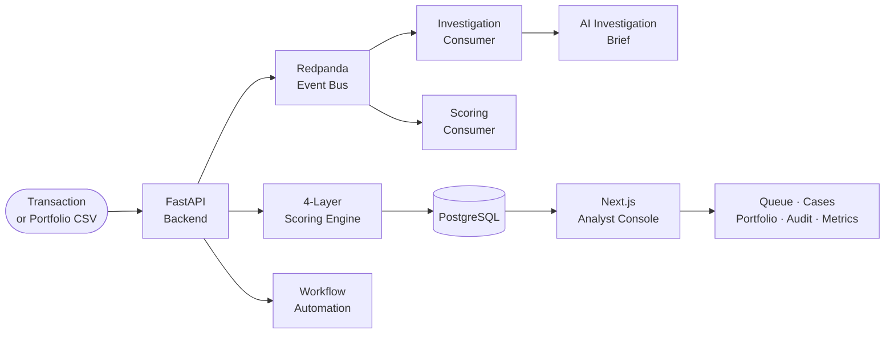
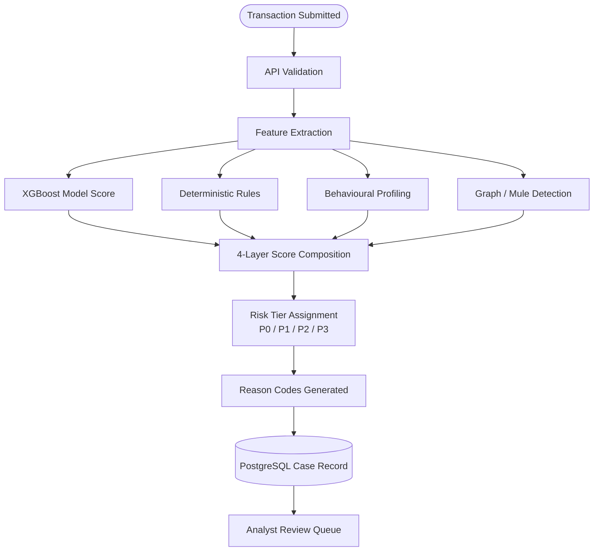
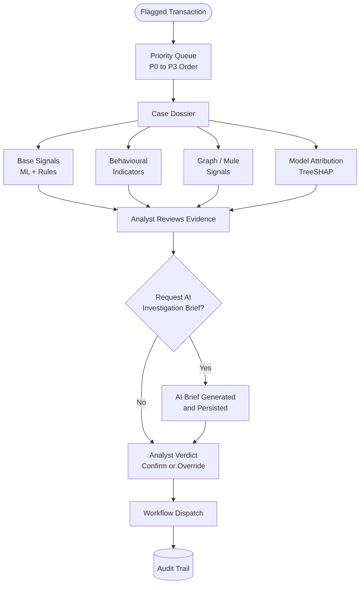
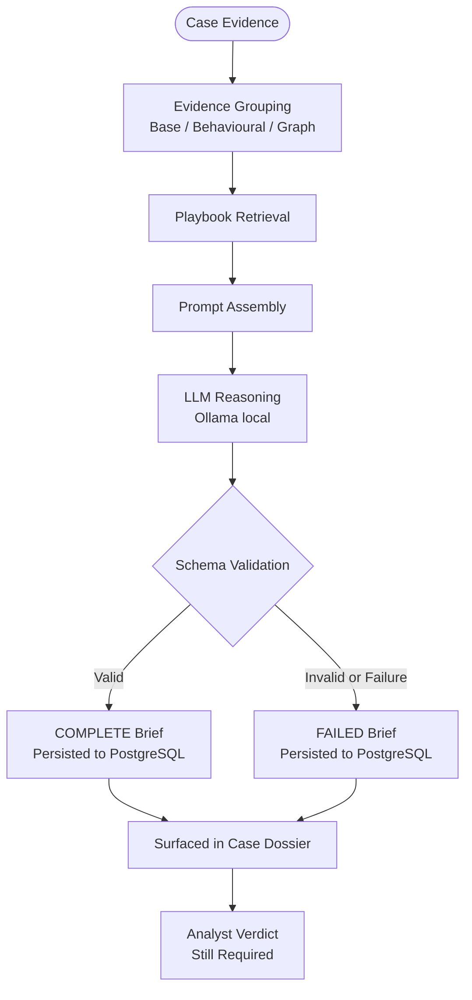
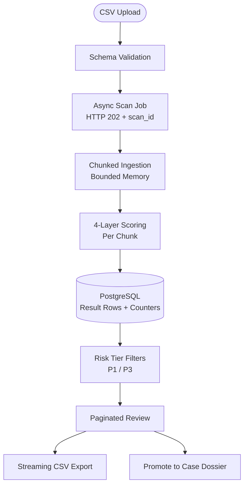
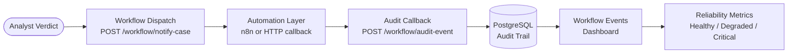

# Real-Time Transaction Fraud Intelligence Console

**Fraud decisioning is an operations problem, not a scoring problem.**


---

## Executive Summary

Transaction fraud teams need more than a risk probability. They need a system that scores
incoming transactions, assigns priority tiers, routes cases to an analyst queue, surfaces
structured evidence in context, supports investigation with AI-generated briefs, captures
formal verdicts, dispatches workflow automation, maintains a queryable audit trail, and
handles portfolio-scale bulk scanning.

This system implements the full transaction fraud decisioning lifecycle: from transaction
intake through 4-layer hybrid scoring, analyst triage, AI-assisted investigation briefing
with bounded failure handling, verdict capture, workflow dispatch with callback-based audit,
and portfolio-scale risk scanning across 10 million transactions.

It is not a fraud classifier. It is a fraud decisioning platform built to show what happens
between a risk score and an analyst decision.

---

## The Problem

A fraud score alone is not operationally complete. It signals that a transaction looks
suspicious. It does not tell an analyst what to review first, why the transaction was
flagged, what evidence supports the flag, what the analyst decided, or whether automation
ran correctly.

| Operational gap | What score-only systems leave unresolved | What this console adds |
|---|---|---|
| No analyst prioritisation | All flagged transactions arrive with equal urgency | P0-P3 risk-tiered analyst review queue |
| No evidence structure | Model output has no grouped investigation context | Evidence-structured Case Dossier: base signals, behavioural indicators, graph topology |
| No investigation support | Analysts take unstructured manual notes | AI investigation briefs: structured, traceable, analyst-controlled |
| No verdict capture | Analyst decisions are informal and unrecorded | Formal verdict with workflow dispatch linkage |
| No audit trail | Automation actions are invisible | Queryable workflow event log with reliability monitoring |
| No portfolio scale | Single transaction prediction only | Async 10M-row scan with indexed review and streaming export |
| No reason codes | Model output is opaque | Per-layer reason codes surfaced in the Case Dossier |

---

## What I Built

A full-stack transaction fraud intelligence console across seven services:

- **4-layer hybrid scoring engine**: XGBoost model score combined with deterministic rule
  controls, behavioural profiling against entity norms, and graph-based mule-network
  detection. Each layer contributes independently to a bounded risk score with per-layer
  reason codes.
- **Analyst review queue**: Priority-ordered case triage with P0-P3 tier labels, risk
  score bars, and surgical status filters.
- **Case Dossier**: Evidence-grouped investigation workspace with base signals,
  behavioural indicators, graph signals, model attribution via TreeSHAP, lifecycle
  timeline, and verdict capture.
- **AI investigation briefs**: Evidence-grouped prompting through Ollama, tagged with
  AGENT_VERSION for traceability. Bounded failure handling produces readable FAILED
  records rather than silent failures. AI assists investigation. Analyst keeps decision
  control.
- **Workflow audit trail**: Every workflow dispatch and callback event is persisted to
  PostgreSQL and surfaced in a reliability monitoring center that computes health verdicts
  from actual event records.
- **Portfolio Risk Scan**: Asynchronous bulk scoring of transaction files. HTTP 202
  response with scan ID. Bounded-memory chunked ingestion. Composite indexed pagination.
  Streaming cursor export. Promote-to-case for individual scan records.
- **7-service Docker Compose runtime**: FastAPI, Next.js, PostgreSQL, Redpanda, Redis,
  scoring consumer, investigation consumer. Single command startup. Fully reproducible.

---

## System at a Glance



| Layer | Components |
|---|---|
| API | FastAPI: scoring, case management, scan jobs, workflow dispatch, 27 endpoints |
| Frontend | Next.js 16: analyst queue, case dossiers, portfolio scan, workflow audit, reliability metrics |
| Persistence | PostgreSQL 16: cases, investigations, verdicts, events, 10M scan results |
| Event streaming | Redpanda (Kafka-compatible): scoring and investigation pipelines |
| Runtime | Docker Compose, 7 services, single command |

---

## Measured Proof Points

| Metric | Result | Type |
|---|---|---|
| Portfolio scan benchmark scale | 10,000,000 transactions | Benchmark |
| Rows processed (valid / invalid / skipped) | 10,000,000 / 0 / 0 | Measured |
| Average scoring throughput | ~1,610 rows/sec | Measured |
| Risk tier coverage | 100% of 10M rows assigned P1 or P3 | Derived |
| Deep pagination (page 1,000 on 10M result set) | 0.379s | Measured |
| Streaming export time to first byte (1.64 GiB file) | 6.987 ms | Measured |
| API restarts during or after 1.64 GiB export | 0 | Measured |
| API memory post-export (peak ~915 MiB during processing) | ~216 MiB stable | Measured |
| End-to-end validation checks | 11 / 11 passed | Measured |
| Release readiness checks | 40 / 40 passed | Measured |
| Scoring intelligence layers | 4 | Implemented |
| Docker Compose services | 7 | Implemented |
| Backend API endpoints | 27 | Implemented |
| Frontend analyst console routes | 8 | Implemented |

No real-world fraud loss reduction is claimed. These metrics reflect the validated
benchmark operating envelope.

---

## How to Review This Repository

| Review path | What to inspect | Where to start |
|---|---|---|
| Executive | Product positioning, decisioning workflow, and benchmark evidence | This README and [Portfolio Case Study](docs/PORTFOLIO_CASE_STUDY.md) |
| Technical | Scoring architecture, async pipeline, AI brief design, and engineering tradeoffs | Intelligence Layers and System Design Tradeoffs sections below |
| Local runtime | Run the console, inspect live cases, test the API surface | [Local Setup](#local-setup) |

---

## End-to-End Process Flows

### 1. Transaction Intake and Scoring



### 2. Analyst Case Dossier and Verdict



### 3. AI Investigation Brief



*AI surfaces investigation context. Analyst keeps decision control. Every brief is tagged
with AGENT_VERSION for traceability.*

### 4. Portfolio Risk Scan



### 5. Workflow Automation and Audit



---

## Intelligence Layers

| Layer | Purpose | Output | Why it matters |
|---|---|---|---|
| Model scoring | XGBoost probability over transaction and device features | Bounded risk probability 0.0 to 1.0 | Captures nonlinear fraud patterns that static rules miss |
| Rule controls | Deterministic flags: high amount, unusual time, risky payment method, risky geography | Binary rule flag; contributes 40% of base score | Transparent, auditable guardrails alongside the model |
| Behavioural profiling | Compares transaction against entity-level norms for amount, velocity, and spend pattern | BEHAVIOURAL_AMOUNT_DEVIATION, BEHAVIOURAL_VELOCITY_DEVIATION, BEHAVIOURAL_PROFILE_SHIFT | Detects individually unremarkable transactions that deviate sharply from an established entity baseline |
| Graph / mule detection | Identifies shared-device clusters, fan-in patterns (mule receivers), and fan-out patterns (distribution accounts) | MULE_FAN_IN_PATTERN, MULE_FAN_OUT_PATTERN, graph boost contribution | Detects coordinated fraud rings invisible to single-transaction analysis |
| AI investigation briefs | Evidence-grouped LLM investigation brief via Ollama, AGENT_VERSION tagged, bounded failure handling | COMPLETE or FAILED brief persisted per case | Structures investigation context for analysts without removing analyst decision control |

**Scoring formula:**

```
base_score = (0.6 x model_output) + (0.4 x rule_flag)
risk_score = clip(base_score + rich_boost + behavioural_boost + graph_boost, 0.0, 1.0)
```

Decision tiers: APPROVE below 0.3, REVIEW 0.3 to 0.7, BLOCK above 0.7. Each layer
contributes independently -- a transaction flagged only by graph topology can reach REVIEW
or BLOCK without triggering behavioural or rule signals.

These thresholds are validated within the synthetic benchmark and adversarial simulation
environment. Institution-specific deployment requires calibration against labelled
historical outcomes, false-positive cost analysis, and model-risk review.

Adversarial simulation validates detection coverage across five fraud pattern families:
velocity manipulation, amount structuring, geographic dispersion, device rotation, and
mule-network coordination.

---

## Model and Rule Tradeoffs

| Option | Strength | Weakness | Decision |
|---|---|---|---|
| Rules-only | Deterministic, transparent, no training data required | Brittle, misses nonlinear patterns, requires constant manual updates | Used as a 40% guardrail component within the base score, not as the sole decision engine |
| Logistic Regression | Explainable coefficients, calibrated probability | Underperforms on nonlinear fraud feature interactions | Not selected; XGBoost dominates tabular fraud scoring without heavy manual feature engineering |
| Random Forest | High accuracy, robust to outliers | Harder to calibrate probability output, larger deployment footprint | Viable alternative; XGBoost selected for tighter calibration and a lighter serialised artifact |
| **XGBoost (selected)** | Strong on nonlinear interactions, calibrated probability output, fast inference, small artifact (~106 KB), TreeSHAP attribution | Requires labelled training data; threshold calibration needed for production | Champion model for structured transaction scoring. Deployable, interpretable, and appropriate for the current tabular feature set |
| Neural network | Learns complex representations at scale | Requires large labelled production datasets, harder to explain, overkill for current structured feature set | Future path with labelled production data; not appropriate at current scale |
| Pure LLM decisioning | Flexible, handles unstructured context | Non-deterministic, unauditable, high latency, not appropriate for enforcement decisions | Rejected for enforcement. LLM used only in the advisory investigation brief layer, with analyst verdict always required |

---

## System Design Tradeoffs

| Decision | Selected | Alternative | Why selected | What was sacrificed |
|---|---|---|---|---|
| Backend API | FastAPI | Flask, Django | Async-native, typed endpoints, Pydantic validation, auto-generated API docs at /docs | Smaller ecosystem than Django |
| Frontend | Next.js 16 | Streamlit | Product-grade multi-page analyst console, TypeScript, full component control | Longer build time than Streamlit prototype |
| Persistence | PostgreSQL 16 | SQLite, file storage | ACID transactions, composite indexes, streaming cursor export, deep pagination at 10M rows | Requires managed setup |
| Event streaming | Redpanda (Kafka-compatible) | Synchronous-only API | Decouples fast scoring from slower investigation; POST /predict returns HTTP 202; investigation retries independently | Infrastructure complexity |
| Cache | Redis 7 | No cache | Idempotency support, fast state access, deduplication | Adds a service to the runtime |
| Workflow automation | n8n callback pattern | Code-only workflow | Callback events are durable and measurable; missing callbacks are detectable in reliability metrics | External dependency |
| AI investigation | Advisory briefs with AGENT_VERSION | Autonomous AI enforcement | Analyst keeps decision control; every brief is traceable to its agent configuration | LLM latency; requires Ollama on host |
| Deployment | Docker Compose (7 services) | Managed cloud | Fully reproducible local review; single command startup; no cloud cost | Not production-scalable without cloud hardening |

---

## Execution Evidence and Observations

These observations shaped the engineering decisions above.

| Observation | Engineering response |
|---|---|
| LLM investigation latency is non-deterministic and would block scoring if coupled synchronously | Separate Redpanda consumers for scoring and investigation; POST /predict returns HTTP 202 immediately |
| Buffering 10M rows into API heap caused instability during export | Server-side cursor iterator streams rows directly to HTTP response without buffering; 1.64 GiB exported with zero restarts |
| Query time grew non-linearly past 500K rows without appropriate indexing | Composite ordered indexes on (scan_id, risk_score DESC, row_number ASC); page 1,000 on 10M rows bounded at 0.379s |
| Recomputing tier summaries across all prior rows degraded at 500K scale | Running counter columns incremented per chunk; O(N^2) recomputation eliminated |
| Ollama failures initially produced invisible or raw error states | Three distinct failure paths each produce analyst-readable FAILED records; no silent failures |
| Automation dispatch had no verification without callbacks | Callback events persisted to PostgreSQL; reliability metrics compute health verdict from actual event records |
| Scoring and investigation consumers have different failure-mode requirements | Intentional durability asymmetry: scoring consumer commits offsets on all paths for forward progress; investigation consumer withholds on unexpected errors for retry |

---

## Measured Improvements and Proof Points

| Score-only baseline | This system | Evidence |
|---|---|---|
| Raw risk score, no prioritisation | P0-P3 risk-tiered analyst queue | 100% of 10M benchmark rows assigned a risk tier |
| Alert list with no context | Evidence-grouped Case Dossier: base, behavioural, graph signals | 12 Playwright-captured screenshots from live run |
| Opaque model output | Reason-coded output with per-layer attribution via TreeSHAP | Model attribution endpoint: GET /cases/{id}/explain |
| Single transaction prediction | 10M-row portfolio scan: bounded ingestion, indexed, streamed export | 10M benchmark: 100% rows processed, zero invalid |
| Manual investigation notes | AI investigation brief: structured, traceable, AGENT_VERSION tagged | Every investigation record links to a specific agent configuration |
| Invisible automation | Workflow event log with callback confirmation | Reliability metrics compute health verdict from real event data |
| Memory-heavy export | Streaming cursor export: 1.64 GiB at 6.987 ms time to first byte | 0 API restarts post-export |
| Flat bulk results | Paginated, filterable, tier-ordered, promotable scan records | Page 1,000 on 10M rows: 0.379s |

---

## Bottlenecks and Engineering Challenges Observed

| Challenge | What was observed | Engineering response | Why it matters |
|---|---|---|---|
| Fast scoring blocked by investigation latency | LLM responses are slow and non-deterministic | Separate Redpanda consumers; POST /predict returns HTTP 202 | Scoring throughput is not coupled to AI availability |
| Memory instability during large export | Full result set in API heap caused instability | Server-side cursor streaming without buffering | 1.64 GiB export stable with zero restarts |
| Deep pagination degradation | Query time grew non-linearly at scale | Composite ordered PostgreSQL indexes | Page 1,000 on 10M rows bounded at 0.379s |
| O(N^2) tier summary recomputation | Recomputing totals across all rows per chunk degraded at 500K rows | Running counter columns incremented per chunk | Scan summary stays responsive at any scale |
| Silent AI investigation failures | Ollama failures produced invisible or raw error states | Three failure paths produce analyst-readable FAILED records with FAILED-state persistence | No investigation attempt disappears without a durable outcome |
| AI audit traceability | LLM output without version traceability cannot support a compliance audit trail | AGENT_VERSION field on every investigation record | Every brief is attributable to the specific agent configuration that produced it |
| Analyst queue without prioritisation | Flat alert lists waste analyst time on low-risk cases | P0-P3 tier scoring at ingestion; server-side tier filters | High-risk cases surface immediately even at 10M portfolio scale |
| Multi-service reproducibility | A 7-service system is difficult to review without cloud credentials | Docker Compose single-command startup | Reviewer can run the full stack locally within seconds |
| Consumer durability under failure | Scoring and investigation need different failure-mode behaviour | Intentional consumer durability asymmetry | Both forward progress and retry correctness are preserved |

---

## Recommended Next Hardening Steps

| Step | Priority |
|---|---|
| Production authentication and RBAC enforcement: JWT or OAuth2, role-gated API endpoints matching the three-role design in AUTH_RBAC_DESIGN.md | High |
| Managed cloud deployment: FastAPI on container hosting, managed PostgreSQL, managed Kafka, monitoring and alerting | High |
| Production monitoring and alerting: per-service health checks, latency tracking, alert escalation for consumer failures | High |
| Model registry and drift monitoring: versioned artifacts, score distribution tracking against production label feedback | Medium |
| Dead letter queue and retry strategy: DLQ for investigation consumer, exponential backoff for Ollama failures | Medium |
| External fraud decision API facade: single integration endpoint encapsulating feature enrichment, 4-layer scoring, case creation, and investigation dispatch | Medium |
| Production labelled-data calibration: threshold calibration using historical labelled fraud outcomes and false-positive cost analysis | Medium |
| Analyst feedback loop: verdict outcomes feed back into model retraining pipeline | Medium |

---

## Screenshots

Playwright-captured from a live local run. All 12 tracked in `docs/screenshots/`.

| # | Screen | File |
|---|---|---|
| 1 | Fraud Intelligence Command Center: live KPI strip, pipeline map, system status | [01_overview_command_center.png](docs/screenshots/01_overview_command_center.png) |
| 2 | Risk Command Dashboard: case intelligence stats, decision mix, verdict outcomes | [02_risk_command_dashboard.png](docs/screenshots/02_risk_command_dashboard.png) |
| 3 | Transaction Intake: guided form with scoring inputs and investigation context | [03_transaction_intake.png](docs/screenshots/03_transaction_intake.png) |
| 4 | Scoring Result Handoff: risk score, tier assignment, reason codes | [04_scoring_result_handoff.png](docs/screenshots/04_scoring_result_handoff.png) |
| 5 | Review Queue Prioritization: P0-P3 tiers, score bars, status filters | [05_review_queue_prioritization.png](docs/screenshots/05_review_queue_prioritization.png) |
| 6 | Case Dossier Evidence: grouped signals, lifecycle timeline, model attribution | [06_case_dossier_evidence.png](docs/screenshots/06_case_dossier_evidence.png) |
| 7 | AI Investigation Panel: structured brief, AGENT_VERSION, bounded failure handling | [07_ai_investigation_panel.png](docs/screenshots/07_ai_investigation_panel.png) |
| 8 | Analyst Verdict Panel: confirm or override, workflow dispatch linkage | [08_analyst_verdict_panel.png](docs/screenshots/08_analyst_verdict_panel.png) |
| 9 | Case Workflow Audit Trail: event log, timestamps, case linkage | [09_case_workflow_audit_trail.png](docs/screenshots/09_case_workflow_audit_trail.png) |
| 10 | False Positive Review Case: analyst override with reason capture | [10_false_positive_review_case.png](docs/screenshots/10_false_positive_review_case.png) |
| 11 | Workflow Events Audit Trail: complete event log with source and status filters | [11_workflow_events_audit_trail.png](docs/screenshots/11_workflow_events_audit_trail.png) |
| 12 | Reliability Metrics Center: health verdict, SLO panels, failure spotlight | [12_reliability_metrics_center.png](docs/screenshots/12_reliability_metrics_center.png) |

---

## Local Setup

**Prerequisites:** Docker Desktop, Node.js 18+, Python 3.11+. Ollama on host for AI
investigations.

**Start the backend stack:**
```
docker compose up -d --build
docker compose run --rm api alembic upgrade head
```

**Start the frontend:**
```
cd fraud-console
npm install
npm run dev
```

Open [http://localhost:3000](http://localhost:3000).

**Seed demo cases:**
```
python scripts/demo_seed.py
```

Or click **Launch Guided Investigation** on the command center home page after the
stack is live.

**Health checks:**
```
curl http://localhost:8000/health
curl http://localhost:8000/health/detailed
```

**API documentation:** [http://localhost:8000/docs](http://localhost:8000/docs)

**Model artifact:** `saved_models/fraud_model.pkl` is tracked in the repository
(approximately 106 KB). No separate download or training step is needed for a fresh
clone. See [docs/MODEL_CARD.md](docs/MODEL_CARD.md) for the artifact contract, feature
schema, and checksum.

---

## Validation and Reproducibility

| Check | Result |
|---|---|
| Release readiness (40 automated checks) | 40 / 40 PASS |
| Frontend TypeScript build | PASS |
| E2E Playwright checks (11 checks, headless Chromium, live stack) | 11 / 11 PASS |
| Detailed health endpoint | GET /health/detailed: all components healthy |
| Model artifact checksum | Verified in CI (fraud_model.pkl SHA256) |
| No video or MP4 file committed | Confirmed |

**Run release readiness checks:**
```
python scripts/verify_release_readiness.py
```

**Run E2E checks (requires live stack):**
```
cd fraud-console
npm run test:e2e
```

---

## Public Documentation

| Document | Purpose |
|---|---|
| [docs/PORTFOLIO_CASE_STUDY.md](docs/PORTFOLIO_CASE_STUDY.md) | Full system and benchmark narrative for technical reviewers |
| [docs/SYSTEM_SNAPSHOT.md](docs/SYSTEM_SNAPSHOT.md) | System identity, runtime configuration, and operational boundaries |
| [docs/MODEL_CARD.md](docs/MODEL_CARD.md) | Model artifact contract, feature schema, checksum, and governance notes |
| [docs/RISK_SCAN_BENCHMARKS.md](docs/RISK_SCAN_BENCHMARKS.md) | Verified 10M benchmark evidence with full metric tables |
| [docs/MLOPS_READINESS.md](docs/MLOPS_READINESS.md) | MLOps maturity and production expansion roadmap |
| [docs/presentation/real-time-fraud-intelligence-console-executive-deck.pptx](docs/presentation/real-time-fraud-intelligence-console-executive-deck.pptx) | Executive presentation deck (12 slides) |

Additional documentation covering API design, consumer durability, auth architecture,
deployment strategy, adversarial simulation, and graph intelligence is available in
the `docs/` directory.

---

## Tech Stack

| Layer | Technologies |
|---|---|
| Frontend | Next.js 16, React 19, TypeScript, Tailwind CSS, TanStack Query, Recharts |
| Backend | FastAPI, Pydantic, Uvicorn |
| Persistence | PostgreSQL 16, SQLAlchemy ORM, Alembic |
| Eventing | Redpanda (Kafka-compatible), kafka-python consumers |
| Cache | Redis 7 |
| Scoring | XGBoost 3.0+, scikit-learn, 4-layer fraud scoring engine |
| AI Investigation | Ollama, evidence-grouped prompting, AGENT_VERSION traceability, structured report persistence |
| Workflow | n8n, webhook dispatch, HTTP callback audit pattern |
| Testing | Playwright 1.60+ |
| Runtime | Docker Compose (7 services) |

---

## Engineering Summary

A transaction fraud decision intelligence platform built across a 7-service Docker Compose
runtime. Implements 4-layer event-driven scoring (XGBoost model + rule controls +
behavioural profiling + graph mule-network detection), PostgreSQL persistence with
composite-indexed 10M-row queries, evidence-grouped Case Dossiers with TreeSHAP model
attribution, hardened AI investigation briefs with AGENT_VERSION traceability, workflow
automation audit trails with callback-based reliability monitoring, and a verified
10M-transaction Portfolio Risk Scan benchmark: ~1,610 rows/sec average throughput, 1.64 GiB
streaming export at 6.987 ms time to first byte, zero API restarts.

Validated through benchmark-scale adversarial simulation across five fraud pattern families
and 11/11 E2E Playwright checks. Governed by a documentation package covering consumer
durability, auth/RBAC architecture, model governance, and deployment readiness. Designed
with a documented calibration path for institution-specific labelled-outcome calibration,
access controls, and production hardening.

---

## Author

**Ijaz Kakkod**

Machine Learning Systems &nbsp;|&nbsp; Fraud Intelligence &nbsp;|&nbsp; Decision Intelligence &nbsp;|&nbsp; Model Governance
