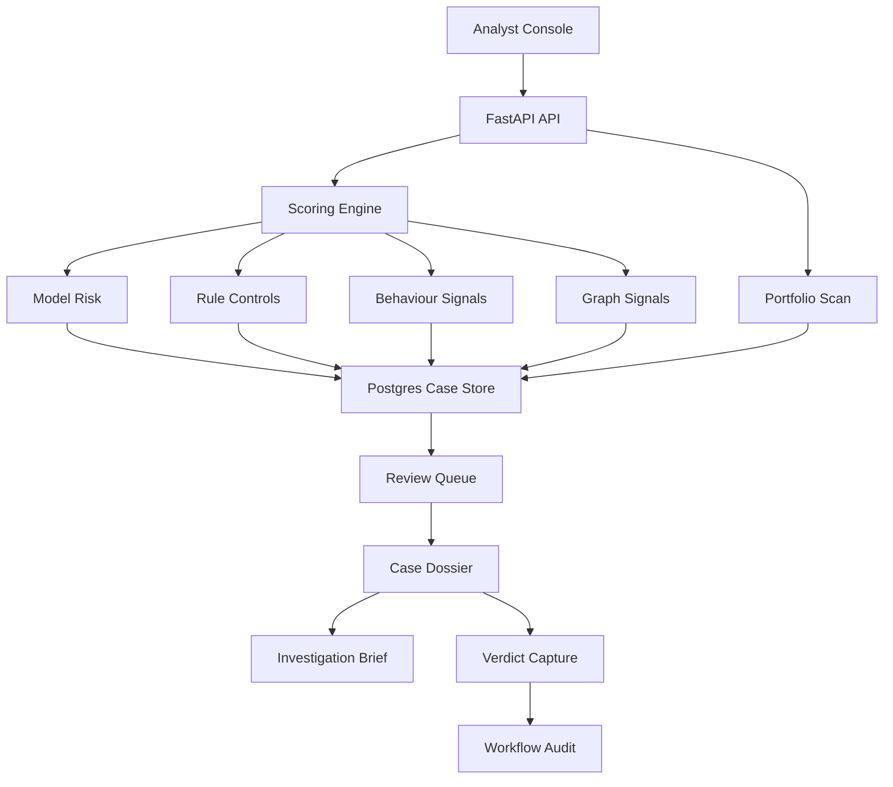
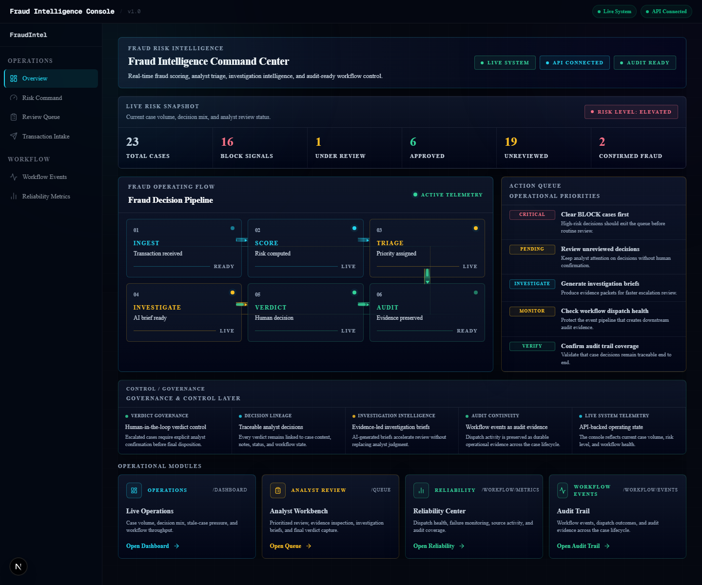
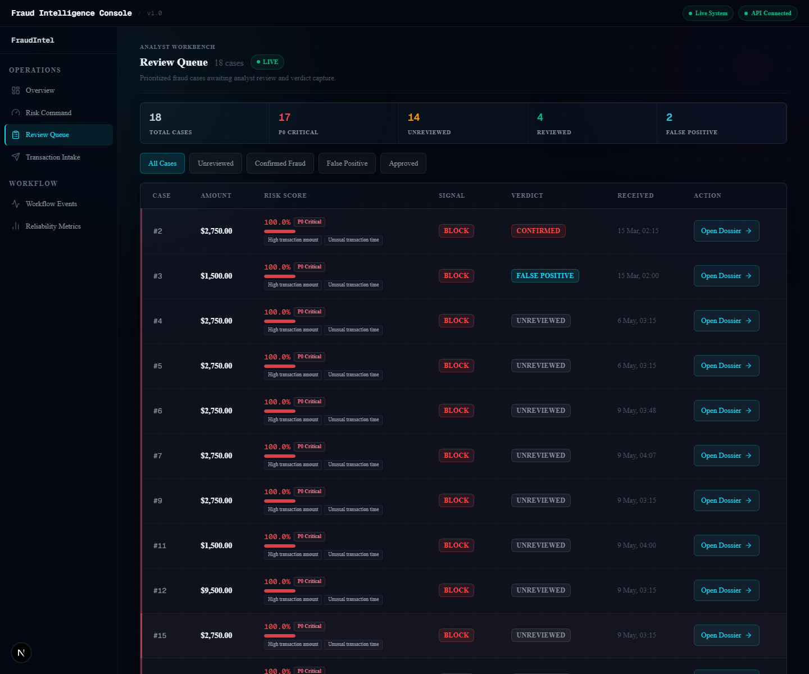
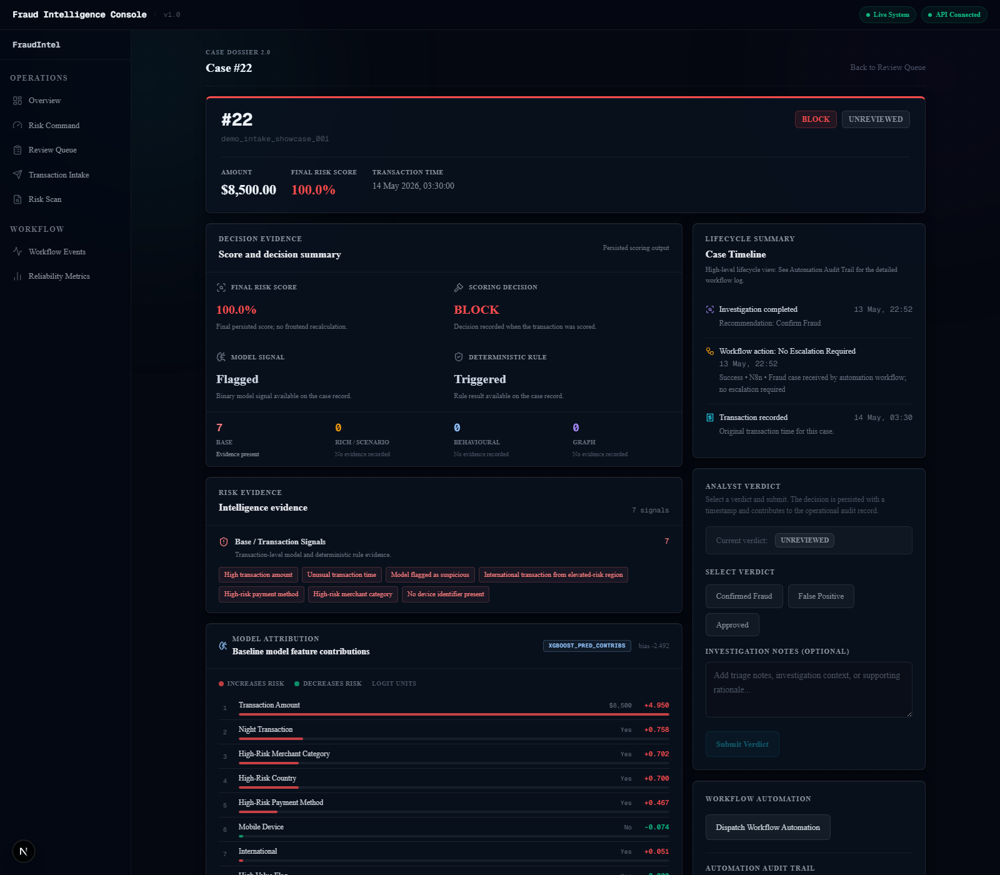
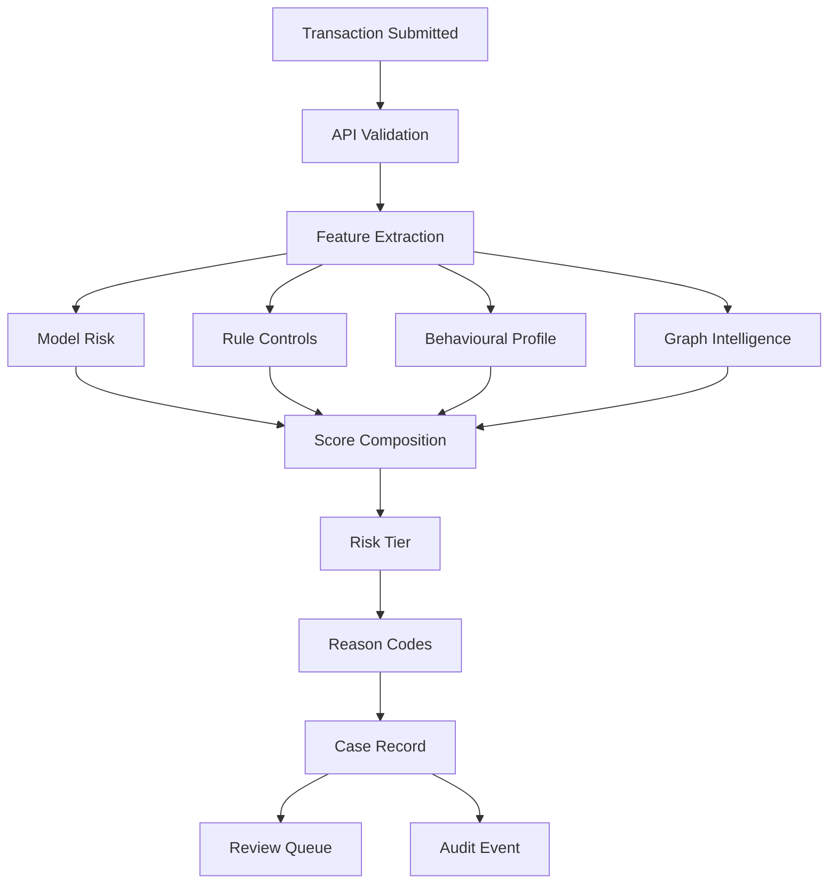
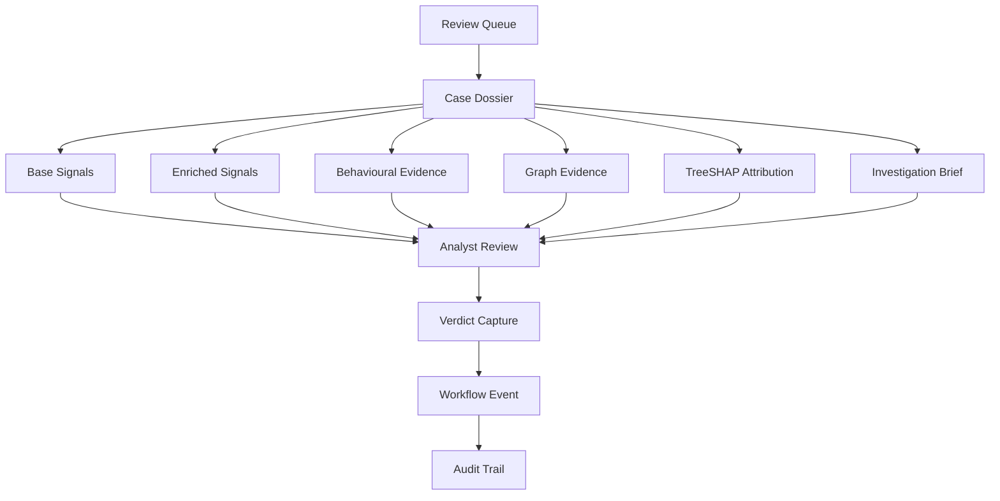
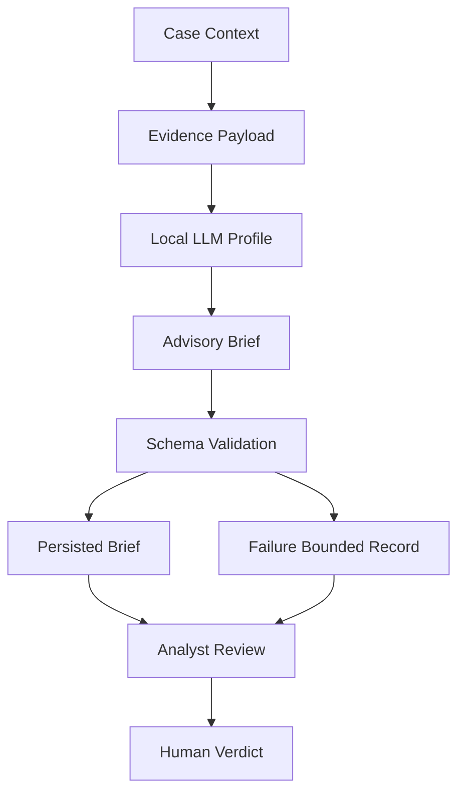
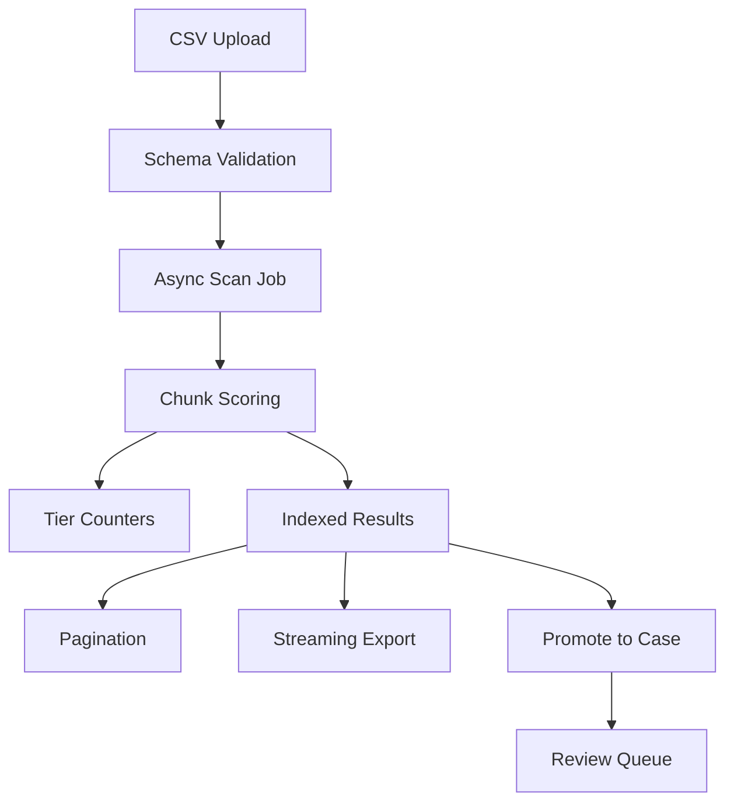
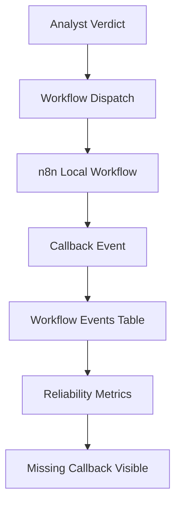

# Real-Time Transaction Fraud Intelligence Console

**Portfolio-scale fraud intelligence, built for risk triage, investigation control, and audit-ready decisioning.**


---

## Executive Summary

A fraud score tells an analyst that a transaction looks suspicious. It does not tell
them which transaction to review first, why it was flagged, what the analyst decided,
or whether automation ran correctly afterwards.

This console implements the complete fraud decisioning lifecycle: from transaction intake
through 4-layer hybrid scoring, risk-tiered analyst queue, evidence-led Case Dossier,
agentic investigation brief, formal verdict capture, workflow dispatch with callback
audit, and portfolio-scale async scanning across 10 million transactions.

The system addresses the operational gap between fraud scoring and fraud investigation.
Every stage has a clear handoff to the next, a durable evidence trail, and a formal
accountability record.

---

## Reviewer Fast Path

| Resource | Access |
|---|---|
| Live inspection console | https://transaction-fraud-intelligence-cons.vercel.app |
| Swagger API | https://fraud-console-api.onrender.com/docs |
| 10M benchmark evidence | [docs/RISK_SCAN_BENCHMARKS.md](docs/RISK_SCAN_BENCHMARKS.md) |
| Model card | [docs/MODEL_CARD.md](docs/MODEL_CARD.md) |
| System snapshot | [docs/SYSTEM_SNAPSHOT.md](docs/SYSTEM_SNAPSHOT.md) |
| Full case study | [docs/PORTFOLIO_CASE_STUDY.md](docs/PORTFOLIO_CASE_STUDY.md) |
| MLOps readiness | [docs/MLOPS_READINESS.md](docs/MLOPS_READINESS.md) |
| Screenshot gallery | [Jump to screenshots](#screenshot-gallery) |

---

## The Fraud Operations Gap

| Fraud operations challenge | Why score-only detection falls short | Console response | Business value |
|---|---|---|---|
| Portfolio-wide triage | Scoring one transaction at a time cannot cover institutional portfolio volume | Async portfolio scan: 10M transactions, bounded memory, indexed pagination | Risk teams gain complete portfolio coverage, not point samples |
| Analyst overload | Flat alert lists force analysts to spend equal time on low-risk and high-risk cases | P0-P3 risk-tiered review queue ordered by descending risk score | Analyst time concentrates on the highest-urgency cases first |
| Risk exposure prioritisation | Raw score does not quantify the dollar value at risk across the portfolio | Exposure surfaced per tier across the full portfolio scan | Risk leadership sees aggregate exposure concentration, not just flagged counts |
| Evidence quality | Model output alone provides no grouped investigation context | Evidence-structured Case Dossier: base signals, behavioural indicators, graph topology, model attribution | Analysts understand why a transaction was flagged, not just that it was |
| Investigation traceability | Manual investigation notes are informal and unrecorded | Formal analyst verdict capture with structured evidence and AI investigation briefs | Every investigation has a documented outcome linked to a case record |
| Workflow accountability | Automation actions with no confirmation create audit blind spots | Workflow callback events persisted to PostgreSQL; missing callbacks visible in reliability monitoring | Automation accountability is measurable, not assumed |
| Large export and downstream review | Analyst UI cannot export millions of scored results without memory instability | Server-side cursor streaming export: 1.64 GiB at 6.987 ms time to first byte, zero restarts | Risk, compliance, and model teams can extract the complete scored portfolio |
| Model and rule transparency | Opaque model output does not support analyst or compliance review | Per-layer reason codes and TreeSHAP model attribution per case | Every decision is explainable to the analyst and traceable to the scoring configuration |
| High-risk case promotion | Portfolio scan results are disconnected from individual case investigation | Promote-to-case: any flagged scan row escalates to a full Case Dossier | A pattern spotted in bulk review moves directly into structured individual investigation |

---

## Fraud Decisioning System

The console connects every stage of the fraud decisioning lifecycle into a structured
operational workflow:

```
Raw transaction or portfolio file
  --> 4-layer hybrid scoring
  --> Risk tier assignment (P0 critical / P1 high / P2 medium / P3 low)
  --> Priority analyst review queue
  --> Evidence-led Case Dossier
  --> agentic investigation brief (advisory; analyst keeps decision control)
  --> Formal analyst verdict
  --> Workflow automation dispatch
  --> Callback audit event
  --> Reliability monitoring
  --> Exportable, paginated portfolio-level risk results
```

The system closes the gap between three operational functions that score-only approaches
leave disconnected:

| Function | What this means operationally |
|---|---|
| Fraud prediction | 4-layer scoring assigns a risk score with per-layer reason codes to every transaction |
| Fraud investigation | Case Dossier surfaces grouped evidence; AI brief provides structured context; analyst records a formal verdict |
| Fraud governance | Every decision, automation action, and AI output is persisted with version traceability |

**Services:** FastAPI (backend), Next.js 16 (analyst console), PostgreSQL 16 (persistence),
Redpanda (event broker), Redis (cache), scoring consumer, investigation consumer -- seven
services, single command startup.

---

## System at a Glance



| Layer | Components |
|---|---|
| API | FastAPI: scoring, case management, scan jobs, workflow dispatch, 27 endpoints |
| Frontend | Next.js 16: analyst queue, case dossiers, portfolio scan, workflow audit, reliability metrics |
| Persistence | PostgreSQL 16: cases, investigations, verdicts, events, 10M scan results |
| Event streaming | Redpanda (Kafka-compatible): scoring and investigation pipelines |
| Runtime | Docker Compose, 7 services, single command |

---

## Operational Fraud Intelligence Results

Benchmark basis: controlled synthetic transaction portfolios were used to validate scale,
tier routing, exposure surfacing, export stability, and investigation workflow behaviour.
Institution-specific deployment would calibrate thresholds, labels, and review policies
against historical fraud outcomes.

| Metric | Result | Type |
|---|---|---|
| 10M benchmark: transactions processed | 10,000,000 / 10,000,000 (100%) | Measured |
| 10M benchmark: valid / invalid / skipped | 10,000,000 / 0 / 0 | Measured |
| 10M benchmark: total portfolio exposure scored | $25,095,000,000 | Measured |
| 10M benchmark: high-priority tier exposure surfaced | $24,455,516,419 | Measured |
| 10M benchmark: average scoring throughput | ~1,610 transactions/sec | Measured |
| 10M benchmark: processing duration | ~103 minutes | Measured |
| 10M benchmark: deep pagination (page 1,000 on 10M result set) | 0.379s | Measured |
| 10M benchmark: streaming export time to first byte (1.64 GiB) | 6.987 ms | Measured |
| 10M benchmark: export duration | 113.63s | Measured |
| 10M benchmark: API restarts during and after export | 0 | Measured |
| 5M benchmark: P0+P1 priority review share | 24.45% (1,222,251 of 5,000,000 transactions) | Measured |
| 5M benchmark: P3 low-risk routing | 75.55% (3,777,749 transactions) | Measured |
| 5M benchmark: total portfolio exposure | $6,982,753,484 | Measured |
| 5M benchmark: P0 critical-tier exposure | $5,058,942,542 | Measured |
| 10K rich scan: P0+P1 priority review share | 24.55% (2,455 of 10,000 transactions) | Measured |
| 10K rich scan: P3 low-risk routing | 70.12% (7,012 transactions) | Measured |
| E2E Playwright checks | 11 / 11 passed | Measured |
| Release readiness checks | 37 / 37 passed | Measured |
| Scoring intelligence layers | 4 | Implemented |
| Backend API endpoints | 27 | Implemented |
| Frontend analyst console | Multi-page analyst workflow covering intake, queue, cases, portfolio scan, audit, and reliability views | Implemented |

---

## From Portfolio Risk to Analyst Decision

The console is designed to move risk from raw transaction data into analyst action.
Portfolio files and individual transactions are scored, routed into priority tiers,
converted into evidence-led cases, and closed through analyst verdicts and workflow audit records.



*Command center view showing system status, fraud intelligence summary, and entry points into triage workflows.*



*Risk-tiered review queue that concentrates analyst attention on P0-P1 priority cases while keeping lower-risk activity filterable.*



*Evidence-led Case Dossier showing the transition from scored transaction to reviewable investigation record.*

| Step | Console action | Fraud operations value |
|---|---|---|
| 1 | Score transaction or portfolio file | Converts raw activity into risk-ranked records |
| 2 | Assign P0-P3 risk tiers | Separates immediate review from lower-risk handling |
| 3 | Route high-priority cases to queue | Concentrates analyst effort on the highest-risk segment |
| 4 | Build Case Dossier | Turns a score into evidence-led investigation context |
| 5 | Generate agentic investigation brief | Supports analyst review without replacing analyst decision control |
| 6 | Capture verdict and workflow callback | Creates an audit-ready decision and automation trail |
| 7 | Export scored portfolio | Enables downstream fraud, risk, and governance review |

---

## Portfolio Triage at Scale

A fraud team cannot manually inspect a 10-million-transaction portfolio. It needs
complete scoring, prioritised review, tiered exposure visibility, and exportable results.

Across three benchmark runs using controlled synthetic transaction data, approximately
24-25% of transactions were routed to P0-P1 priority review, with 70-75% scoring P3
low-risk. This concentration allows analyst review to focus on the highest-risk quarter
of the portfolio rather than a flat, undifferentiated alert list.

| Benchmark | Transactions scored | Priority review (P0+P1) | Low-risk routing (P3) | Primary evidence | Operational meaning |
|---|---|---|---|---|---|
| 10K legacy scan | 10,000 | 24.59% (2,459 transactions) | 75.41% (7,541 transactions) | Consistent priority routing behaviour across a compact synthetic portfolio | Consistent tier routing established at baseline scale |
| 10K rich banking scan | 10,000 | 24.55% (2,455 transactions) | 70.12% (7,012 transactions) | Rich signal tier routing with P0-P1 priority concentration and P3 low-risk handling | Rich signal layer confirmed on synthetic banking scenarios |
| 5M benchmark | 5,000,000 | 24.45% (1,222,251 transactions) | 75.55% (3,777,749 transactions) | $6.98B total exposure scored; $5.06B surfaced in P0 critical tier | Review queue concentrated on 1 in 4 transactions; $5.06B critical-tier surfaced |
| 10M benchmark | 10,000,000 | 100% assigned P1 or P3 | -- | $25.1B total exposure scored; $24.5B surfaced in high-priority tier | $25 billion portfolio scored, tiered, and exported in a single async run |

All benchmark figures are from controlled synthetic portfolios.

**10M benchmark operational evidence:**

| Capability | Evidence |
|---|---|
| Async upload acceptance | HTTP 202 in 5.79s; scan job returned immediately without blocking the API |
| Processing | 10,000,000 / 10,000,000 rows; zero invalid; zero skipped; ~103 minutes; ~1,610 transactions/sec |
| Paginated analyst review | Page 1 in 0.676s; page 2 in 0.247s; deep page 1,000 in 0.379s after composite index hardening |
| P1 tier filter query | 8,420,051 matching rows returned in 4.188s |
| Streaming export | 1.64 GiB / 10,000,001 lines; TTFB 6.987 ms; duration 113.63s; zero API restarts; OOMKilled false |
| Promote-to-case | Individual scan rows promotable to full Case Dossiers via the portfolio scan interface |

---

## Critical Findings from Implementation

Implementing the console showed that transaction fraud is not solved by a model score
alone. The operational challenge is converting risk signals into prioritised review,
evidence-led investigation, accountable workflow actions, and measurable feedback loops.

| Finding | Evidence from implementation | Business impact |
|---|---|---|
| Fraud detection becomes useful only when connected to workflow | Scoring, tier assignment, Case Dossier review, AI investigation briefs, analyst verdicts, workflow dispatch, and callback audit events are linked in one lifecycle | Converts fraud prediction into a complete fraud decisioning workflow |
| Priority routing can reduce analyst overload | Across the 5M, 10K legacy, and 10K rich synthetic benchmarks, roughly 24-25% of transactions routed to P0-P1 priority review while 70-75% routed to P3 low-risk handling | Analysts can focus immediate review on the riskiest quarter of the portfolio instead of a flat alert list |
| Portfolio-wide scoring changes the review model | The 10M benchmark processed 10,000,000 / 10,000,000 rows, scored $25.1B in portfolio exposure, exported 1.64 GiB of results with zero invalid rows, zero skipped rows, and zero API restarts | Risk teams can move from sample-based inspection to full-portfolio triage, filtering, export, and downstream review |
| Investigation governance is as important as model accuracy | Each case can include model attribution, behavioural indicators, graph signals, AI investigation context, analyst verdict, workflow dispatch, and callback audit events | Fraud decisions become explainable, reviewable, and traceable for compliance, disputes, analyst handover, and model governance |

---

## Core Challenges Addressed

| Challenge | Why it matters in fraud operations | System response | Remaining hardening path |
|---|---|---|---|
| False positives versus analyst workload | Too many alerts overwhelm investigators and increase customer friction | Risk tiers, priority review routing, P3 low-risk handling, analyst queue filters | Use analyst verdicts and confirmed outcomes to tune thresholds and reduce false positive rates |
| False negatives versus fraud loss exposure | Missed fraud produces direct loss, customer impact, and delayed detection | Hybrid model/rule scoring, behavioural signal expansion, graph mule indicators, adversarial scenario validation | Add labelled outcome evaluation, recall monitoring, and champion/challenger models |
| Scale versus usability | A fraud system that can score millions of rows but cannot filter, page, or export results is not operationally useful | Async scan jobs, persisted risk tiers, indexed pagination, streaming export, promote-to-case | Add saved review cohorts, analyst assignment queues, and downstream case management integrations |
| AI assistance versus decision control | Fraud enforcement cannot rely on unbounded autonomous LLM output | AI investigation briefs are advisory, schema-validated, failure-bounded, persisted, and reviewed by analysts | Add production prompt governance, version comparison, and investigation quality scoring |
| Auditability versus automation opacity | Workflow automation must be traceable when actions succeed, fail, or never callback | Workflow dispatch and callback events are persisted; reliability metrics surface missing or degraded events | Add DLQ, retry policy, alerting, and external audit sink integrations |

---

## Investigation and Audit Control

Scoring identifies risk. The Case Dossier makes the evidence structured and actionable.
Every alert becomes an investigation record with a durable outcome.

**Case Dossier evidence groups:**

| Evidence group | Contents |
|---|---|
| Base signals | ML risk score, decision tier, rule flag, 9-feature signal factors, reason codes |
| Enriched signals | Device trust score, geo distance, velocity, failed attempts, merchant risk, new payee, chargeback history |
| Behavioural indicators | Amount deviation from entity baseline, velocity deviation, balance drop ratio, new device, new country, new counterparty, unusual channel |
| Graph intelligence | Shared device indicator, cross-account device reuse, counterparty fan-in, counterparty fan-out |

**Analyst decisioning and governance:**

| Capability | How it works | Governance value |
|---|---|---|
| Model attribution | Per-feature XGBoost contributions via TreeSHAP at GET /cases/{id}/explain | Every scored decision is explainable at the feature level |
| AI investigation brief | Structured recommendation, confidence rating, risk and mitigating factors, rules triggered, playbooks referenced | AI supports the analyst. Analyst verdict always required before any operational action. |
| Version-tracked AI brief traceability | Every investigation record tagged with the agent configuration that produced it | Every AI brief is attributable to the specific model configuration in use at the time |
| Bounded failure handling | Ollama failure, schema failure, and unexpected errors each produce a specific visible failure-state record | No investigation attempt disappears silently. Analysts see failure state, not a blank. |
| Formal verdict capture | Analyst submits Confirmed Fraud / False Positive / Approved with notes | Every case outcome is formally recorded and linked to the case record |
| Workflow dispatch | Verdict triggers workflow notification; automation layer processes the case event | Automation is triggered by analyst decision, not by model output alone |
| Callback audit trail | Every automation action writes a callback event to PostgreSQL | Missing or failed callbacks are visible in reliability monitoring |
| Reliability monitoring | Health verdict computed from actual event records: Healthy / Degraded / Critical | Fraud operations leadership can see automation health without querying service logs |

---

## How Transactions Move Through the System

These flows show how the console converts fraud signals into operational decisions.

### 1. Transaction Intake and Scoring



### 2. Analyst Case Dossier and Verdict



### 3. Advisory Investigation Brief



*Advisory brief surfaces structured investigation context. Analyst keeps decision control. Every brief is version-tracked and failure-bounded.*

### 4. Portfolio Risk Scan



### 5. Workflow Automation and Audit



---

## Intelligence Layers

| Layer | Purpose | Output | Why it matters |
|---|---|---|---|
| Model scoring | XGBoost probability over transaction and device features | Bounded risk probability 0.0 to 1.0 | Captures nonlinear fraud patterns that static rules miss |
| Rule controls | Deterministic flags: high amount, unusual time, risky payment method, risky geography | Binary rule flag; contributes 40% of base score | Transparent, auditable guardrails alongside the model |
| Behavioural profiling | Compares transaction against entity-level norms for amount, velocity, and spend pattern | BEHAVIOURAL_AMOUNT_DEVIATION, BEHAVIOURAL_VELOCITY_DEVIATION, BEHAVIOURAL_PROFILE_SHIFT | Detects individually unremarkable transactions that deviate sharply from an entity baseline |
| Graph / mule detection | Identifies shared-device clusters, fan-in patterns (mule receivers), and fan-out patterns (distribution accounts) | MULE_FAN_IN_PATTERN, MULE_FAN_OUT_PATTERN, graph boost contribution | Detects coordinated fraud rings invisible to single-transaction analysis |
| AI investigation briefs | Evidence-grouped investigation brief, version-tracked, bounded failure handling | COMPLETE or failure-state brief persisted per case | Structures investigation context for analysts without removing analyst decision control |

The risk score is composed from model risk, rule controls, behavioural indicators, and graph
intelligence. The exact signal composition is documented in the model governance record and
can be calibrated for institution-specific labelled outcomes.

Decision tiers: APPROVE below 0.3, REVIEW 0.3 to 0.7, BLOCK above 0.7. Each layer
contributes independently -- a transaction flagged only by graph topology can reach REVIEW
or BLOCK without triggering behavioural or rule signals.

These thresholds are validated within the synthetic benchmark and adversarial simulation
environment. Institution-specific deployment requires calibration against labelled
historical outcomes, false-positive cost analysis, and model-risk review.

Adversarial simulation validates detection coverage across five fraud pattern families:
velocity manipulation, amount structuring, geographic dispersion, device rotation, and
mule-network coordination.

---

## Model and Rule Tradeoffs

| Option | Strength | Trade-off | Decision |
|---|---|---|---|
| Rules-only | Deterministic, transparent, no training data required | Brittle, misses nonlinear patterns, requires constant manual updates | Used as a 40% guardrail component within the base score, not as the sole decision engine |
| Logistic Regression | Explainable coefficients, calibrated probability | Underperforms on nonlinear fraud feature interactions | Not chosen as the primary scoring layer; XGBoost is a strong practical fit for structured tabular fraud scoring |
| Random Forest | High accuracy, robust to outliers | Harder to calibrate probability output, larger deployment footprint | Viable alternative; XGBoost selected for tighter calibration and a lighter serialised artifact |
| **XGBoost (selected)** | Strong on nonlinear interactions, calibrated probability output, fast inference, small artifact (~106 KB), TreeSHAP attribution | Requires calibration data for institution deployment; threshold tuning applies at institution scale | Champion model for structured transaction scoring. Deployable, interpretable, and appropriate for the current tabular feature set |
| Neural network | Learns complex representations at scale | Requires large labelled production datasets; not necessary for the current structured tabular scoring layer | Reserved for future labelled-outcome expansion |
| Pure LLM decisioning | Flexible, handles unstructured context | Non-deterministic, unauditable, high latency; not appropriate for enforcement decisions | Constrained to advisory investigation support. LLM used only in the investigation brief layer, with analyst verdict always required |

---

## System Design Tradeoffs

| Decision | Selected | Alternative | Why selected | What was sacrificed |
|---|---|---|---|---|
| Backend API | FastAPI | Flask, Django | Async-native, typed endpoints, Pydantic validation, auto-generated API docs at /docs | Smaller ecosystem than Django |
| Frontend | Next.js 16 | Streamlit | Product-grade multi-page analyst console, TypeScript, full component control | Longer build time than a simpler analytics tool |
| Persistence | PostgreSQL 16 | SQLite, file storage | ACID transactions, composite indexes, streaming cursor export, deep pagination at 10M rows | Requires managed setup |
| Event streaming | Redpanda (Kafka-compatible) | Synchronous-only API | Decouples fast scoring from slower investigation; POST /predict returns HTTP 202; investigation retries independently | Infrastructure complexity |
| Cache | Redis 7 | No cache | Idempotency support, fast state access, deduplication | Adds a service to the runtime |
| Workflow automation | n8n callback pattern | Code-only workflow | Callback events are durable and measurable; missing callbacks are detectable in reliability metrics | External dependency |
| AI investigation | Advisory briefs with version-tracked investigation configuration | Autonomous AI enforcement | Analyst keeps decision control; every brief is traceable to its agent configuration | LLM latency; requires Ollama on host |
| Deployment | Docker Compose (7 services) | Managed cloud | Fully reproducible for local review; single command startup; no cloud credentials required | Cloud infrastructure required for deployment at institution scale |

---

## Engineering Hardening Journey

Each scale step exposed a different operational failure mode. The system was hardened
before the next scale step was attempted.

| Scale / scenario | Failure mode observed | Engineering response | Fraud operations value |
|---|---|---|---|
| 500K rows | Tier summary recomputation re-scanned all prior rows after each chunk; O(N^2) degradation | Running counter columns incremented per chunk | Scan summary remains responsive regardless of portfolio size |
| 2.5M rows | PostgreSQL table bloat from prior benchmark churn slowed reads; export buffered too much state before flushing | VACUUM FULL and dead-space reclaim; StreamingResponse introduced | Large portfolio scans do not accumulate bloat into subsequent runs |
| 5M rows | Export routed through UI pagination helper; timed out before first byte after ~26 minutes; API restarted | Server-side cursor export with bounded-batch iterator; dedicated path separate from UI pagination | 824.14 MB export stable at 5M rows; TTFB 0.0055s; zero restarts |
| 7.5M rows | Result queries scanned by scan_id and sorted millions of rows without composite index support | Composite ordered indexes with NULLS LAST on (scan_id, risk_score DESC, row_number ASC) and on (scan_id, tier, risk_score DESC, row_number ASC) | Page 1,000 on 10M rows bounded at 0.379s after index hardening |
| 10M rows | Full end-to-end validation required after ingestion, export, dedup, and index hardening | Bounded-memory benchmark mode; 10M benchmark passed end-to-end | $25.1B portfolio scored, tiered, paginated, and exported; zero restarts; zero invalid rows |
| AI investigation failures | Ollama failures produced invisible or raw error states with no durable outcome | Three distinct failure paths each produce analyst-readable visible failure-state records persisted to PostgreSQL | No investigation attempt disappears without a visible, durable outcome |
| Workflow audit blind spots | Automation dispatch with no confirmation created audit gaps | Callback events persisted to PostgreSQL; reliability metrics compute health verdict from actual event records | Missing or failed automation actions are detectable in the reliability dashboard, not hidden |
| Analyst queue without prioritisation | Flat alert lists waste analyst time on low-risk cases at any portfolio scale | P0-P3 tier assignment at ingestion; server-side tier filters on scan results | High-risk cases surface at the top of the analyst queue regardless of portfolio volume |

---

## Institution Deployment Expansion Path

Institution-specific deployment would expand fraud detection and governance capabilities across these areas:

| Recommendation | Fraud problem addressed | How the console supports it | Business value | Priority |
|---|---|---|---|---|
| Closed-loop fraud outcome feedback | Fraud teams cannot reduce false positives or false negatives reliably unless analyst decisions and downstream fraud outcomes become labelled feedback | Use analyst verdicts, confirmed fraud, false positives, chargebacks, disputes, and manual overrides as outcome labels for threshold calibration, rule tuning, model retraining, drift monitoring, and fraud-pattern analysis | Creates a measurable improvement loop where the console becomes stronger as real fraud outcomes are observed | High |
| Calibrate thresholds using institution-specific labelled fraud outcomes | Current thresholds (REVIEW 0.3 / BLOCK 0.7) are validated on synthetic data and may produce incorrect FPR or FNR on real portfolios | Environment-variable thresholds are already configurable; analyst verdict history provides the calibration signal | Reduces both missed fraud and unnecessary analyst burden on legitimate transactions | High |
| Track false positive and false negative rates from analyst verdicts | Without verdict outcome tracking, the team does not know how many fraud cases are being missed or over-flagged | Every analyst verdict (Confirmed Fraud / False Positive / Approved) is persisted to PostgreSQL with case linkage; verdict aggregates are queryable | Quantifies the real cost of scoring error in operational terms | High |
| Feed confirmed fraud and false-positive verdicts back into model retraining | The initial model is trained on synthetic data; institution verdicts and confirmed outcomes become the higher-value calibration layer | Verdict records in PostgreSQL are the basis for a labelled outcome dataset that can drive retraining | Improves model precision and recall over time as real institution fraud patterns replace synthetic training data | High |
| Add score distribution and feature drift monitoring | A model calibrated today may degrade silently as fraud patterns and customer behaviour evolve | The scoring pipeline produces per-transaction risk scores; score distribution aggregates over time are the input signal for drift detection | Prevents silent model degradation before it causes missed fraud at portfolio scale | Medium |
| Extend behavioural features using account, device, payee, and merchant history | Fraud that mimics legitimate customer behaviour is invisible to transaction-level scoring alone | The behavioural boost layer already activates on entity-level deviation columns; extended features require enriched transaction context from upstream data | Detects account takeover, synthetic identity, and mule-account patterns that pure transaction scoring misses | Medium |
| Expand graph intelligence with velocity rings, temporal fan patterns, and account clusters | Coordinated fraud rings and structuring patterns require temporal and network-topology views beyond a single scan window | The graph boost layer already implements shared-device and fan-in/fan-out detection; velocity ring patterns require temporal linkage across transactions | Detects money laundering structuring and coordinated ring patterns that static scoring cannot surface | Medium |
| Add cost-sensitive thresholds based on fraud loss, review cost, and customer friction | A single threshold treats a $50 transaction and a $50,000 transaction identically; that is not operationally sound | Risk tier assignment (P0-P3) already incorporates score-based differentiation; institution-specific cost curves drive threshold separation | Maximises expected loss prevention relative to available review resource | Medium |
| Separate real-time blocking threshold from review threshold | Blocking a legitimate high-value customer transaction carries significant cost; the review threshold should be more sensitive than the block threshold | REVIEW_THRESHOLD and BLOCK_THRESHOLD are independent environment variables; institution calibration tunes both independently | Reduces false block rate on high-value customers while maintaining detection sensitivity | Medium |
| Introduce champion/challenger model governance | A production fraud model needs safe experimentation paths before rollout; full replacement without shadow testing creates unnecessary risk | The model loads from a serialised artifact; a champion/challenger architecture routes a percentage of traffic to a challenger model for comparison | Allows safer model evolution without exposing the full portfolio to an untested configuration | Medium |
| Monitor rule fatigue and rule decay | Deterministic rules that were relevant at launch may become ineffective as fraud patterns shift and attackers adapt | Rule flag firing rates are computable from prediction records in PostgreSQL; a rule performance view detects decaying coverage | Prevents false confidence in stale rule controls | Lower |
| Feed downstream chargebacks and disputes back into case outcomes | Chargebacks often arrive weeks after a transaction is approved; that confirmed fraud signal is valuable model and threshold calibration input | The verdict capture infrastructure supports a future chargeback ingestion endpoint that writes retrospective CONFIRM_FRAUD verdicts against case records | Closes the feedback loop between analyst decisions today and fraud outcomes weeks later | Lower |

---

## Screenshot Gallery

| # | Screen | File |
|---|---|---|
| 1 | Fraud Intelligence Command Center: live KPI strip, pipeline map, system status | [01_overview_command_center.png](docs/screenshots/01_overview_command_center.png) |
| 2 | Risk Command Dashboard: case intelligence stats, decision mix, verdict outcomes | [02_risk_command_dashboard.png](docs/screenshots/02_risk_command_dashboard.png) |
| 3 | Transaction Intake: guided form with scoring inputs and investigation context | [03_transaction_intake.png](docs/screenshots/03_transaction_intake.png) |
| 4 | Scoring Result Handoff: risk score, tier assignment, reason codes | [04_scoring_result_handoff.png](docs/screenshots/04_scoring_result_handoff.png) |
| 5 | Review Queue Prioritization: P0-P3 tiers, score bars, status filters | [05_review_queue_prioritization.png](docs/screenshots/05_review_queue_prioritization.png) |
| 6 | Case Dossier Evidence: grouped signals, lifecycle timeline, model attribution | [06_case_dossier_evidence.png](docs/screenshots/06_case_dossier_evidence.png) |
| 7 | AI Investigation Panel: structured brief, version-tracked traceability, bounded failure handling | [07_ai_investigation_panel.png](docs/screenshots/07_ai_investigation_panel.png) |
| 8 | Analyst Verdict Panel: confirm or override, workflow dispatch linkage | [08_analyst_verdict_panel.png](docs/screenshots/08_analyst_verdict_panel.png) |
| 9 | Case Workflow Audit Trail: event log, timestamps, case linkage | [09_case_workflow_audit_trail.png](docs/screenshots/09_case_workflow_audit_trail.png) |
| 10 | False Positive Review Case: analyst override with reason capture | [10_false_positive_review_case.png](docs/screenshots/10_false_positive_review_case.png) |
| 11 | Workflow Events Audit Trail: complete event log with source and status filters | [11_workflow_events_audit_trail.png](docs/screenshots/11_workflow_events_audit_trail.png) |
| 12 | Reliability Metrics Center: health verdict, SLO panels, failure spotlight | [12_reliability_metrics_center.png](docs/screenshots/12_reliability_metrics_center.png) |

---

## Live Inspection Environment

Live inspection environment:
https://transaction-fraud-intelligence-cons.vercel.app

Backend API and Swagger:
https://fraud-console-api.onrender.com/docs

The hosted inspection environment runs the console on Vercel, Render, and Neon Postgres in
synchronous scoring mode. It supports transaction scoring, analyst triage, evidence-led
case review, workflow audit views, and small portfolio risk scans on controlled synthetic
transaction data.

The local Docker Compose package remains the full-stack runtime for Kafka-backed
asynchronous scoring, local LLM investigation brief generation, and workflow automation.
Kafka, local LLM inference, and n8n automation are intentionally excluded from the hosted
free-tier profile. In this profile, `/health/detailed` reports Postgres as healthy while
Kafka and Ollama are unavailable by design.

---

## Local Setup

**Prerequisites:** Docker Desktop, Node.js 18+, Python 3.11+. Ollama on host for AI
investigations.

**Start the backend stack:**
```
docker compose up -d --build
docker compose run --rm api alembic upgrade head
```

**Start the frontend:**
```
cd fraud-console
npm install
npm run dev
```

Open [http://localhost:3000](http://localhost:3000).

**Seed review cases:**
```
python scripts/seed_review_cases.py
```

Or click **Launch Guided Investigation** on the command center home page after the
stack is live.

**Health checks:**
```
curl http://localhost:8000/health
curl http://localhost:8000/health/detailed
```

**API documentation:** [http://localhost:8000/docs](http://localhost:8000/docs)

**Model artifact:** `saved_models/fraud_model.pkl` is tracked in the repository
(approximately 106 KB). No separate download or training step is needed for a fresh
clone. See [docs/MODEL_CARD.md](docs/MODEL_CARD.md) for the artifact contract, feature
schema, and checksum.

---

## Validation and Reproducibility

| Check | Result |
|---|---|
| Release readiness (37 automated checks) | 37 / 37 PASS |
| Frontend TypeScript build | PASS |
| E2E Playwright checks (11 checks, headless Chromium, live stack) | 11 / 11 PASS |
| Detailed health endpoint | GET /health/detailed: components report per runtime profile |
| Model artifact checksum | Verified in CI (fraud_model.pkl MD5) |
| Public release hygiene | Public README links only curated product, model, benchmark, and executive documentation |

**Run release readiness checks:**
```
python scripts/verify_release_readiness.py
```

**Run E2E checks (requires live stack):**
```
cd fraud-console
npm run test:e2e
```

---

## Public Documentation

| Document | Purpose |
|---|---|
| [docs/PORTFOLIO_CASE_STUDY.md](docs/PORTFOLIO_CASE_STUDY.md) | Full system and benchmark narrative for technical reviewers |
| [docs/SYSTEM_SNAPSHOT.md](docs/SYSTEM_SNAPSHOT.md) | System identity, runtime configuration, and operational boundaries |
| [docs/MODEL_CARD.md](docs/MODEL_CARD.md) | Model artifact contract, feature schema, checksum, and governance notes |
| [docs/RISK_SCAN_BENCHMARKS.md](docs/RISK_SCAN_BENCHMARKS.md) | Verified 10M benchmark evidence with full metric tables |
| [docs/MLOPS_READINESS.md](docs/MLOPS_READINESS.md) | MLOps maturity and production expansion roadmap |

---

## Tech Stack

| Layer | Technologies |
|---|---|
| Frontend | Next.js 16, React 19, TypeScript, Tailwind CSS, TanStack Query, Recharts |
| Backend | FastAPI, Pydantic, Uvicorn |
| Persistence | PostgreSQL 16, SQLAlchemy ORM, Alembic |
| Eventing | Redpanda (Kafka-compatible), kafka-python consumers |
| Cache | Redis 7 |
| Scoring | XGBoost 3.0+, scikit-learn, 4-layer fraud scoring engine |
| AI Investigation | Ollama, evidence-grouped prompting, version-tracked AI brief traceability, structured report persistence |
| Workflow | n8n, webhook dispatch, HTTP callback audit pattern |
| Testing | Playwright 1.60+ |
| Runtime | Docker Compose (7 services) |

---

## Engineering Summary

A transaction fraud decisioning platform built across a 7-service Docker Compose runtime.
Implements 4-layer event-driven scoring (XGBoost model + rule controls + behavioural
profiling + graph mule-network detection), PostgreSQL persistence with composite-indexed
10M-row queries, evidence-grouped Case Dossiers with TreeSHAP model attribution, hardened
AI investigation briefs with version-tracked investigation brief traceability, workflow automation audit trails
with callback-based reliability monitoring, and a verified 10M-transaction Portfolio Risk
Scan benchmark: ~1,610 transactions/sec average throughput, $25.1B portfolio exposure scored,
1.64 GiB streaming export at 6.987 ms time to first byte, zero API restarts.

Consistent tier routing across three benchmark runs (5M-transaction scan, 10K legacy scan, 10K
rich banking scan): 24-25% of transactions routed to P0-P1 priority review, 70-75% to
P3 low-risk, on controlled synthetic data. Validated through adversarial simulation across
five fraud pattern families and 11/11 E2E Playwright checks. Governed by a documentation
package covering consumer durability, auth/RBAC architecture, model governance, and
deployment readiness. Designed with a documented calibration path for institution-specific
labelled-outcome calibration, access controls, and production hardening.

---

## License

This project is source-available for product inspection and technical evaluation only. All rights are reserved. No permission is granted to copy, modify, redistribute, host, deploy, sublicense, incorporate, or use the code without prior written permission from the author.

See [LICENSE](LICENSE).

---

## Author

**Ijaz Kakkod**

Machine Learning Systems &nbsp;|&nbsp; Fraud Intelligence &nbsp;|&nbsp; Decision Intelligence &nbsp;|&nbsp; Model Governance
