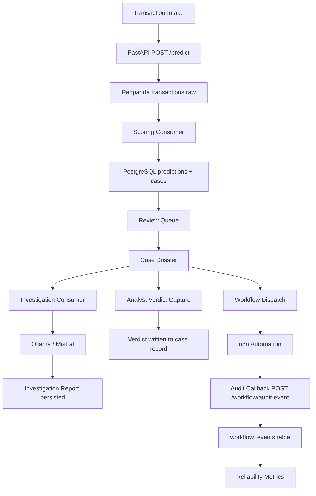
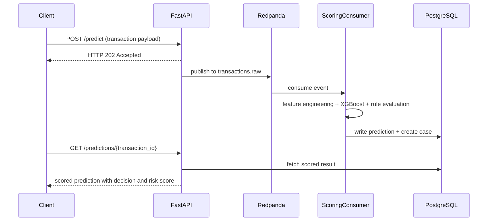
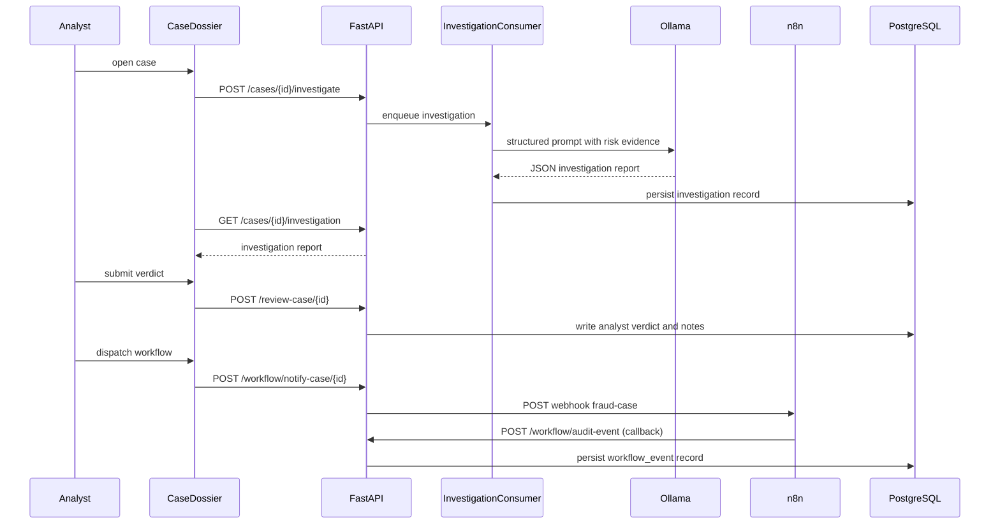
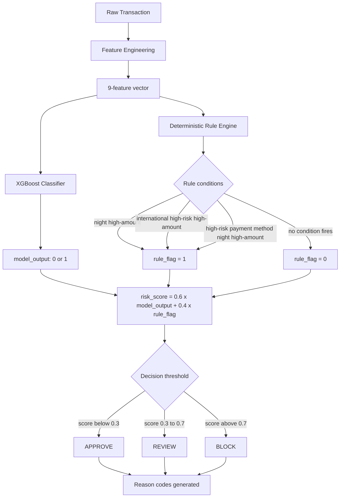

# Fraud Intelligence Console


---

## Local Product Surfaces

This product runs locally via Docker Compose. Deployment planning is in progress under Phase 11P. No public URL is available yet.

| Surface | URL |
|---|---|
| Frontend | http://localhost:3000 |
| Backend API | http://localhost:8000 |
| API documentation (Swagger) | http://localhost:8000/docs |
| n8n workflow editor | http://localhost:5678 |
| Redpanda Pandaproxy | http://localhost:8082 |
| Redpanda Console (dev profile) | http://localhost:8080 |

**Recommended walkthrough flow:**

Transaction Intake -> Review Queue -> Case Dossier -> Workflow Events -> Reliability Metrics

---

## System Summary

Fraud review operations require more than a probability score. A raw model output produces a decision signal, but the downstream work - triage prioritization, investigation context, analyst verdict capture, workflow dispatch, and audit trail generation - remains unaddressed. Fraud analysts reviewing a live queue need to know why a case scored as it did, what the AI investigation concludes, what automated workflows have touched the case, and whether the automation infrastructure that processed it is operating within acceptable reliability bounds.

The Fraud Intelligence Console is a decision intelligence layer built for fraud review operations. It connects an event-driven transaction scoring pipeline to a structured review interface, an AI investigation engine, a workflow automation layer, and a reliability monitoring surface. Every component produces real data: risk scores derive from a live ML pipeline, investigations are generated by a local LLM instance, workflow events are written by a live n8n automation callback, and reliability metrics aggregate from actual event records in PostgreSQL.

The system covers the full case lifecycle from transaction intake to final analyst disposition, with a complete and queryable audit trail at each stage. It is designed to demonstrate how decision intelligence infrastructure behaves under real operational conditions - including realistic degraded reliability states, preserved historical audit failures, and unreviewed caseload pressure.

---

## Quantitative Snapshot

| Dimension | Value |
|---|---|
| Runtime | Docker Compose (7 services) |
| Frontend routes | 7 product routes |
| Backend services | FastAPI, PostgreSQL, Redis, Redpanda, scoring consumer, investigation consumer, n8n |
| Scoring formula | risk_score = (0.6 x model_output) + (0.4 x rule_flag) |
| Model | Enhanced XGBoost baseline, 9-feature vector, synthetic training data |
| Decision tiers | APPROVE (below 0.3), REVIEW (0.3 to 0.7), BLOCK (above 0.7) |
| Feature dimensions | 9 engineered binary and continuous features |
| Deterministic rules | 3 conditions: night high-amount, international high-risk high-amount, high-risk payment method night high-amount |
| Workflow events after demo seed | 22 events (10 FAILED preserved, 12 SUCCESS) |
| Reliability state after demo seed | Critical (10 preserved dispatch failures exceed threshold; 54.5% success rate below 70% floor) |
| Demo cases | Case 21: REVIEW, risk_score=0.6, FALSE_POSITIVE verdict; Case 22: BLOCK, risk_score=1.0, unreviewed P0 |
| AI investigation | Ollama/Mistral (local host) |
| Demo seed script | python scripts/demo_seed.py |

---

## Technology Stack

| Layer | Technologies |
|---|---|
| Frontend | Next.js 16, React, TypeScript, Tailwind CSS, TanStack Query, Recharts |
| API | FastAPI, Pydantic, Uvicorn |
| Persistence | PostgreSQL 16, SQLAlchemy ORM, Alembic migrations |
| Eventing | Redpanda (Kafka-compatible), topic-based async stream, kafka-python consumer |
| Cache | Redis |
| ML scoring | XGBoost 3.0+, scikit-learn, joblib, pandas, NumPy |
| AI investigation | Ollama (local), Mistral model, structured JSON prompt with schema enforcement and retry logic |
| Workflow automation | n8n, webhook dispatch, HTTP callback to FastAPI audit endpoint |
| Runtime | Docker Compose |

---

## Business Problem

Fraud teams operate under conditions that a raw model output alone cannot address. A scored transaction produces a probability estimate, but the analyst workload begins where the model stops: the case must be triaged against everything else in the queue, the available risk evidence must be assembled and inspected, an investigation context must be formed, a decision must be recorded, and the downstream workflow triggered by that decision must be verified to have executed correctly.

When these steps are handled by separate, unconnected tools, traceability degrades. Analysts work without a shared audit record. Workflow failures are invisible until complaints arrive downstream. Reliability problems in the automation layer accumulate silently until they exceed tolerance. A score in isolation is not an operationally complete output.

Auditability is a specific requirement in fraud review, not an incidental feature. Operational audit expectations require that every case has a documented decision chain: who reviewed it, what they concluded, when the workflow was triggered, and whether the automation performed correctly. Systems that do not natively produce this chain force teams to reconstruct it manually, at cost and with error exposure.

---

## System Objective

**Decision support.** The scoring engine evaluates each transaction against a 9-feature risk vector and applies a weighted combination of XGBoost model output and deterministic rule evaluation. The result is a risk score mapped to one of three actionable decision tiers: APPROVE, REVIEW, or BLOCK. Each scored case produces a set of human-readable reason codes surfacing the specific risk signals that drove the score.

**Fraud triage.** The Review Queue presents the full caseload sorted by descending risk score and decision tier. Priority labels (P0 through P3) identify cases requiring the most immediate attention. Status filters allow analysts to focus on unreviewed cases, confirmed fraud, false positives, or approved cases in isolation. The queue is the operational starting point for the analyst shift.

**AI investigation.** Each case has a dedicated investigation report generated by a locally hosted LLM (Ollama/Mistral). The report includes a structured recommendation (CONFIRM_FRAUD, FALSE_POSITIVE, or ESCALATE), a confidence rating, risk factors, mitigating factors, triggered rules, referenced playbooks, and recommendation rationale. The report is available within the Case Dossier alongside the raw risk evidence.

**Analyst workflow.** The Case Dossier provides a structured verdict capture interface. Analysts submit a verdict (Confirmed Fraud, False Positive, or Approved), attach free-text notes, and record the review. Verdicts persist against the case record and are reflected in the Review Queue status badges and dashboard statistics.

**Workflow automation.** Cases can be dispatched to an n8n automation workflow from the Case Dossier. The n8n workflow evaluates the case and writes a structured audit event back to the FastAPI API via callback. The dispatch action, callback result, escalation priority, and human-readable action label are all persisted in the workflow_events table and surfaced in the case-scoped audit trail.

**Reliability and audit visibility.** The Automation Reliability Center aggregates all workflow events into SLO-style metrics: success rate, dispatch failure rate, automation coverage, and a health verdict (Healthy, Degraded, or Critical). Historical dispatch failures are preserved rather than purged, providing an accurate observability record of system behaviour over time.

---

## System Value

| Capability | Operational change |
|---|---|
| Hybrid scoring | Risk scores account for both model signal and deterministic rule conditions simultaneously, rather than relying on either alone |
| Review Queue prioritization | Analysts see the highest-risk cases first with P0-P3 tier labels, eliminating manual sort effort |
| Case Dossier | All evidence, investigation output, analyst verdict, and automation history for a case are co-located in a single workspace |
| AI investigation | Each case has a structured LLM-generated investigation report available on demand, without requiring additional analyst research time |
| Analyst verdict capture | Verdicts are structured and persistent, written directly to the case record rather than recorded in a separate system |
| Workflow audit events | Every automation dispatch and callback produces a durable, queryable record with status, source, action, and case linkage |
| Reliability metrics | Dispatch failure rates, success rates, and health verdicts are computed from the actual event record, not self-reported |
| Demo seed state | Reproducible demo state via API-only seeding; canonical case IDs and investigation states are recoverable after any database reset |

---

## Role in Workflow

The console sits between raw transaction events and downstream fraud operations decisioning.

**Upstream inputs:**
- Transaction data submitted via the intake form or API
- Event stream from the Redpanda broker (transactions.raw topic)
- Transaction attributes: amount, timestamp, country, payment method, merchant category, device identifiers, international flag

**Console functions:**
- Event-driven scoring via the XGBoost pipeline and rule engine
- Case creation and persistence in PostgreSQL
- AI investigation generation via the investigation consumer and Ollama
- Review queue triage and analyst verdict capture
- Workflow automation dispatch and callback audit
- Reliability metrics aggregation

**Downstream outputs:**
- Analyst decisions (Confirmed Fraud, False Positive, Approved) written to case records
- Workflow audit events written by n8n callback and persisted to the workflow_events table
- Escalation priority assignments surfaced in the audit trail
- Aggregated reliability state available for operational reporting



---

## Architecture

### A. End-to-End Runtime Flow

```
Transaction Intake
  -> POST /predict
  -> Redpanda (transactions.raw)
  -> Scoring Consumer
  -> PostgreSQL (predictions + cases)
  -> Review Queue (/queue)
  -> Case Dossier (/cases/[id])
  -> AI Investigation (investigation-consumer -> Ollama/Mistral)
  -> Analyst Verdict (POST /review-case/{case_id})
  -> Workflow Dispatch (POST /workflow/notify-case/{case_id} -> n8n)
  -> Audit Callback (POST /workflow/audit-event <- n8n)
  -> Workflow Events (/workflow/events)
  -> Reliability Metrics (/workflow/metrics)
```

### B. Event-Driven Scoring Architecture



### C. Case Investigation and Workflow Architecture



### D. Decisioning Flow



---

## Model and Decisioning

The scoring engine is an enhanced baseline hybrid model. It is not a production-certified fraud detection model and should not be treated as one. The XGBoost classifier was trained on a 1,000-row synthetic dataset with engineered risk signals. Training accuracy on synthetic data does not reflect expected performance against real-world fraud distributions.

The model produces a binary output (0 or 1) which is combined with a deterministic rule flag (0 or 1) using a configurable weighted formula:

```
risk_score = (MODEL_WEIGHT x model_output) + (RULE_WEIGHT x rule_flag)
```

Default weights: MODEL_WEIGHT = 0.6, RULE_WEIGHT = 0.4. Both are configurable via environment variables.

### Feature vector

| Feature | Derivation |
|---|---|
| `amount` | Transaction amount (continuous) |
| `is_high_amount` | amount > HIGH_AMOUNT_THRESHOLD (default: $1,000) |
| `is_night_transaction` | Hour < 6 or > 22 UTC |
| `is_international` | Explicit boolean from transaction payload |
| `is_high_risk_payment_method` | credit_card, digital_wallet |
| `is_high_risk_country` | Country not in low-risk whitelist (US, CA, GB, AU, DE, FR, NL, JP) |
| `is_high_risk_merchant_category` | electronics, gaming, travel |
| `has_device_id` | 0 when device_id is absent or null |
| `is_mobile_device` | 1 when device_type is mobile |

### Deterministic rule conditions

Any rule condition firing sets rule_flag = 1.

| Rule | Condition |
|---|---|
| Night high-amount | is_high_amount = 1 AND is_night_transaction = 1 |
| International high-risk high-amount | is_high_amount = 1 AND is_international = 1 AND is_high_risk_country = 1 |
| High-risk payment method, night, high-amount | is_high_risk_payment_method = 1 AND is_night_transaction = 1 AND is_high_amount = 1 |

### Decision thresholds

All thresholds are overridable via environment variables.

| Score range | Decision | Threshold |
|---|---|---|
| Below REVIEW_THRESHOLD | APPROVE | REVIEW_THRESHOLD default: 0.3 |
| REVIEW_THRESHOLD to BLOCK_THRESHOLD | REVIEW | BLOCK_THRESHOLD default: 0.7 |
| Above BLOCK_THRESHOLD | BLOCK | |

---

## Core Components

### Transaction Intake

The intake form at `/intake` accepts a transaction payload across three structured input sections: scoring inputs (amount, timestamp, country, payment method, merchant category, international flag), transaction identity (user ID, merchant ID, currency, city), and investigation context (device ID, device type, IP address). On submission, the form posts to `POST /predict` and polls `GET /predictions/{transaction_id}` for the scored result. A handoff link in the score result panel navigates directly to the Case Dossier for that case.

### Scoring Engine

The scoring engine runs inside the scoring consumer as an event-driven worker. It reads raw transaction events from the Redpanda `transactions.raw` topic, runs the transaction through the feature engineering pipeline, evaluates the XGBoost model, applies the three deterministic rule conditions, combines the outputs using the weighted formula, and writes the prediction and case records to PostgreSQL. The consumer runs continuously and processes events as they arrive from the broker.

### Event Pipeline

Transaction events flow through a Kafka-compatible Redpanda broker. `POST /predict` publishes the raw transaction JSON to the `transactions.raw` topic and returns HTTP 202 immediately. The scoring consumer subscribes to that topic and processes each event asynchronously. AI investigation events flow through a separate consumer subscribed to the `cases.created` topic. Both consumers run as long-lived Docker services.

### Review Queue

The Review Queue at `/queue` displays all cases sorted by descending risk score, with BLOCK as the tie-breaker for equal scores. Each row shows a P0-P3 priority tier label, a risk score bar, decision badge, analyst status badge, and reason code preview. Status filters allow the queue to be narrowed to any single analyst status or displayed in full. BLOCK rows are visually highlighted with a red left border.

Priority tier assignment:
- P0: BLOCK decision or risk_score >= 0.85
- P1: risk_score >= 0.7
- P2: risk_score >= 0.4
- P3: all other cases

### Case Dossier

The Case Dossier at `/cases/[id]` is the full investigation workspace for a single case. It displays the case header (risk score bar, decision badge, analyst verdict badge), a risk evidence panel (rule flag, reason tags, timestamp, transaction metadata), the AI investigation panel, the analyst verdict capture form, and the case-scoped workflow automation audit trail. All data is fetched from the live API.

### AI Investigation

The investigation consumer subscribes to the `cases.created` topic and triggers an investigation when a new case is available. It assembles a structured prompt from the case evidence - including risk score, decision, reason codes, feature values, and rule flags - and sends it to a local Ollama instance configured with the Mistral model. The response is parsed against a constrained JSON schema enforcing enumerated values for recommendation and confidence. On schema validation failure the call is retried up to a configured maximum before the investigation is marked failed.

The investigation report includes:
- Recommendation: CONFIRM_FRAUD, FALSE_POSITIVE, or ESCALATE
- Confidence: HIGH, MEDIUM, or LOW
- Risk factors (list)
- Mitigating factors (list)
- Rules triggered (list)
- Playbooks referenced (list)
- Recommendation rationale and confidence rationale (text)

Investigations can be re-triggered from the Case Dossier using the Re-run Investigation button, which posts to `POST /cases/{case_id}/investigate`.

### Analyst Verdict Capture

The analyst verdict panel in the Case Dossier accepts a structured verdict selection (Confirmed Fraud, False Positive, or Approved), free-text analyst notes, and a submit action. The verdict is posted to `POST /review-case/{case_id}` and persisted to the case record. The analyst status is then reflected in the Review Queue status badges and the Case Dossier case header.

### Workflow Automation

The Workflow Automation panel in the Case Dossier dispatches a case to an n8n automation workflow via `POST /workflow/notify-case/{case_id}`. The n8n workflow evaluates the case, determines whether escalation is required, and writes a structured audit event back to `POST /workflow/audit-event`. The audit event includes the workflow action, status (SUCCESS or FAILED), escalation priority, source, and human-readable message.

Source labels displayed in the UI are sanitised: n8n is shown as Automation; fastapi is shown as API.

### Workflow Events

The Automation Audit Trail at `/workflow/events` shows the full history of all workflow events. The audit summary rail displays counts for total events, successful, failed, escalations, and case-linked events. Events are filterable by status (All, Success, Failed) and source (All, Automation, API, Manual). FAILED rows are highlighted with a red left border. Each event links back to its associated Case Dossier where applicable.

Historical FAILED events are preserved in the audit trail intentionally. They represent the period before the n8n production webhook path was active and provide accurate volume for the Reliability Metrics aggregation.

### Reliability Metrics

The Automation Reliability Center at `/workflow/metrics` aggregates all workflow events into operational health metrics. The health verdict (Healthy, Degraded, or Critical) is computed from the success rate and dispatch failure count. SLO-style progress bars display current values for Success Rate, Dispatch Failure Rate, and Automation Coverage. A failure spotlight section identifies non-zero dispatch failures. Action and source breakdown charts show the distribution of workflow actions and originating sources. A reliability outcome donut chart displays the aggregate success percentage.

### Demo Seed Script

`scripts/demo_seed.py` seeds two canonical demo cases via HTTP API calls only. It checks API health before proceeding, uses idempotency checks to avoid duplicate cases, polls for scoring and investigation completion, submits analyst verdicts where required, and confirms workflow audit events. The script requires no database access and no direct service connections beyond the FastAPI API at `http://localhost:8000`.

---

## Product Surfaces

| Route | Surface | Purpose |
|---|---|---|
| `/` | Fraud Intelligence Command Center | Live KPI strip, animated 6-stage pipeline map, stale case SLA pressure indicator, operational module navigation |
| `/dashboard` | Risk Command Center | Decision mix chart, case intelligence stats grid, verdict outcome breakdown, workflow health activity feed |
| `/intake` | Transaction Intake | Guided intake form with three input sections, scoring result panel, and Case Dossier handoff link |
| `/queue` | Analyst Workbench | Prioritised review queue with P0-P3 tiers, risk score bars, decision and status badges, status filters |
| `/cases/[id]` | Investigation Workspace | Full case dossier with risk evidence panel, AI investigation report, analyst verdict form, and workflow audit trail |
| `/workflow/events` | Automation Audit Trail | Full workflow event log with audit summary rail, status and source filters, and case linkage |
| `/workflow/metrics` | Automation Reliability Center | Health verdict, SLO-style reliability panels, failure spotlight, action and source breakdown charts |

---

## API Surface

| Method | Endpoint | Description |
|---|---|---|
| GET | `/health` | API health check |
| POST | `/predict` | Submit transaction for async risk scoring (returns HTTP 202) |
| GET | `/predictions/{transaction_id}` | Poll for scored result after submission |
| GET | `/review-queue` | Retrieve case queue, filterable by analyst status |
| GET | `/case/{case_id}` | Retrieve full case record |
| POST | `/cases/{case_id}/investigate` | Trigger or re-run AI investigation for a case |
| GET | `/cases/{case_id}/investigation` | Retrieve AI investigation report for a case |
| POST | `/review-case/{case_id}` | Submit analyst verdict and notes |
| POST | `/workflow/notify-case/{case_id}` | Dispatch case to n8n workflow automation |
| POST | `/workflow/audit-event` | Write a workflow audit event (n8n callback target) |
| GET | `/workflow/events` | Retrieve all workflow events |
| GET | `/workflow/events?case_id={case_id}` | Retrieve workflow events filtered by case |
| GET | `/workflow/metrics` | Retrieve aggregated workflow reliability metrics |
| GET | `/workflow/daily-summary` | Retrieve daily fraud operations summary |
| GET | `/workflow/stale-cases` | Retrieve cases exceeding the review SLA threshold |

Full interactive documentation is available at `http://localhost:8000/docs` when the stack is running.

---

## Demo State

Two canonical demo cases are seeded by `python scripts/demo_seed.py`. Full seeding instructions, case profiles, and the product surface walkthrough guide are in [docs/DEMO_STATE.md](docs/DEMO_STATE.md).

| Case | transaction_id | Decision | risk_score | rule_flag | analyst_status | Investigation |
|---|---|---|---|---|---|---|
| 21 | demo_review_false_positive_001_a750 | REVIEW | 0.6 | 0 | FALSE_POSITIVE | COMPLETE, FALSE_POSITIVE, MEDIUM confidence |
| 22 | demo_intake_showcase_001 | BLOCK | 1.0 | 1 | null (unreviewed) | COMPLETE, CONFIRM_FRAUD, HIGH confidence |

**Case 21** demonstrates a mid-risk false positive path. A $750 night transaction from Russia using a credit card for electronics with no device identifier. The amount falls below the HIGH_AMOUNT_THRESHOLD, so the deterministic rule does not fire (rule_flag=0). The XGBoost model assigns a positive fraud signal based on the risk profile, producing risk_score=0.6 and a REVIEW decision. Analyst verdict set to FALSE_POSITIVE with notes.

**Case 22** is the primary intake showcase case. An $8,500 night transaction from Russia using a credit card for electronics with no device identifier. Both the deterministic rule and the model fire at maximum confidence, producing risk_score=1.0 and a BLOCK decision. Left unreviewed to demonstrate the P0 unreviewed queue state and the Transaction Intake handoff path.

The seed script is idempotent by transaction_id. Running it against a stack that already contains these cases reuses the existing records without creating duplicates.

---

## Operational Flow

1. Start Docker services: `docker compose up -d` and confirm all seven services are running with `docker compose ps`.
2. Confirm API health: `curl http://localhost:8000/health`.
3. Start the frontend: `cd fraud-console && npm run dev`.
4. Open Transaction Intake at `http://localhost:3000/intake`. Use the intake form to submit a transaction manually or enter the Case 22 profile ($8,500, country RU, night timestamp, credit card, electronics, no device ID).
5. Observe the scoring result panel. The decision, risk score, and reason codes appear after the scoring consumer processes the event from the Redpanda stream.
6. Follow the Open Case Dossier handoff link into the Case Dossier for the submitted case.
7. Review the risk evidence panel. Trigger or inspect the AI investigation report.
8. Submit an analyst verdict using the verdict dropdown and notes field.
9. Dispatch workflow automation using the Dispatch Workflow Automation button. The automation audit trail updates within seconds when the n8n callback writes the audit event.
10. Navigate to `/workflow/events` to inspect the full automation audit trail with status and source filters.
11. Navigate to `/workflow/metrics` to review the health verdict, SLO-style reliability panels, and failure spotlight.

---

## Runtime Reliability and Auditability

Every workflow automation action produces a durable `workflow_events` record in PostgreSQL. The record captures:

| Field | Content |
|---|---|
| `workflow_action` | Action performed: NO_ESCALATION_REQUIRED, ESCALATE_TO_FRAUD_OPS, WORKFLOW_DISPATCH_FAILED |
| `status` | SUCCESS or FAILED |
| `source` | Originating service: n8n, fastapi, or manual |
| `escalation_priority` | HIGH, MEDIUM, or LOW |
| `message` | Human-readable action summary |
| `case_id` | Case linkage (where applicable) |
| `created_at` | UTC timestamp |

Historical dispatch failures are preserved in the audit trail and reflected in Reliability Metrics. The 10 FAILED events present after demo seeding represent the period before the n8n production webhook path was activated. Preserving them provides an accurate observability record rather than a sanitised all-green display.

The Automation Reliability Center computes its health verdict from actual event data. A Degraded verdict when dispatch failures exist is the accurate operational state. Reliability tools that selectively delete their own evidence are not credible reliability tools.

---

## Known System Constraints

| Constraint | Detail |
|---|---|
| Synthetic training data | The XGBoost model was trained on synthetic data. Training accuracy does not reflect real-world fraud detection performance. |
| Local Docker Compose runtime | All services run locally. No production deployment has been completed. |
| No authentication layer | The API and frontend have no authentication or authorisation in the current release. |
| Cloud deployment not completed | Deployment planning is in progress under Phase 11P. No public URL is available. |
| n8n workflow must be active | The n8n workflow must be published and active for audit callbacks to succeed. Dispatch events are written as FAILED when n8n is unreachable. |
| Model is a decisioning baseline | The scoring engine is not a certified or production-validated fraud detection model. |
| Case IDs change after DB reset | If the PostgreSQL volume is deleted and the stack restarted, all case IDs change. Re-run `python scripts/demo_seed.py` after a reset and update docs/DEMO_STATE.md with the new IDs. |
| Investigation requires Ollama on host | The investigation consumer connects to Ollama at `host.docker.internal:11434`. AI investigations will not complete if Ollama is not running on the host machine. |
| No dead-letter handling | Failed scoring or investigation consumer events are logged and skipped. Failed messages are not routed to a dead-letter topic. |

---

## Key Design Tradeoffs

### Event-driven scoring vs synchronous scoring

Async scoring via Redpanda decouples the API from the scoring computation, allows the consumer to scale independently, and produces a clean event record in the broker. The tradeoff is that `POST /predict` returns HTTP 202 and the client must poll `GET /predictions/{transaction_id}` for the result. A synchronous path (`SYNC_SCORING_ENABLED=true`) is available for development convenience and is controlled by environment variable.

### Hybrid model plus rules vs model-only decisioning

The weighted combination of XGBoost output and a deterministic rule flag allows the scoring system to enforce known fraud patterns - high-value night transactions, international high-risk combinations - regardless of model confidence. A model-only approach would miss these cases if the model output is uncertain. The tradeoff is that the rule flag can override a low model score, which requires careful threshold calibration to avoid false positives at the BLOCK tier.

### Preserved historical failures vs all-green demo state

Historical WORKFLOW_DISPATCH_FAILED events from the pre-production webhook activation period are preserved in the audit trail. This produces a Critical health verdict in Reliability Metrics, which is the accurate operational state. Deleting those records would produce a misleading Healthy verdict that does not reflect actual system history.

### API-only seed script vs direct database seeding

`scripts/demo_seed.py` uses only HTTP API calls. No direct database connections, no ORM imports, no SQL. This means the seed script exercises the actual product flow rather than bypassing it, and it remains valid across database schema changes as long as the API contract is stable. The tradeoff is that the script depends on the full stack being healthy, including the scoring and investigation consumers.

### Local workflow automation with n8n vs hardcoded backend workflow

The n8n integration externalises workflow logic from the FastAPI backend. Workflow conditions, escalation routing, and audit payload construction live in a visual workflow editor rather than in application code. The tradeoff is an additional service dependency: if n8n is not running or the webhook path is not published, dispatch events fail and are recorded as WORKFLOW_DISPATCH_FAILED in the audit trail.

### Baseline XGBoost model vs full production fraud model

The current model is deliberately positioned as a decisioning baseline. It demonstrates the scoring architecture, feature pipeline, and hybrid rule combination without overstating detection capability. Future phases (Phase 13 onward) plan to add behavioral velocity signals, entity-level history, and graph-level network features. The current model's decisions are driven by synthetic data patterns that may not reflect real fraud distributions.

---

## Repository Structure

```
real-time-fraud-triage-system/
  src/
    api/                    # FastAPI application, all HTTP endpoints, Pydantic schemas
    config/                 # Shared scoring configuration and environment variable loading
    db/                     # SQLAlchemy models and PostgreSQL persistence layer
    events/                 # Kafka event schemas, Redpanda producer, scoring consumer
    features/               # Feature engineering pipeline (9-feature vector)
    investigation/          # AI investigation consumer, Ollama reasoner, retriever, tools
    models/                 # XGBoost model training script and inference pipeline
    rules/                  # Deterministic fraud rule evaluation (3 rule conditions)
    triage/                 # Decision logic: APPROVE / REVIEW / BLOCK threshold mapping
    pipeline/               # End-to-end fraud pipeline orchestration
    monitoring/             # Structured logging
    utils/                  # Shared utilities
  fraud-console/            # Next.js 16 frontend
    app/                    # App Router pages: /, /dashboard, /intake, /queue, /cases/[id], /workflow/*
    components/             # Shared UI components (cases, dashboard, intake, queue, workflow, layout)
    lib/                    # API client, TanStack Query hooks, Zod schemas, utilities
  alembic/                  # Database migration files
  data/
    raw/                    # Raw transaction data (placeholder)
    processed/              # Processed feature data (placeholder)
    synthetic/              # Synthetic training dataset and generation script
    knowledge/              # Knowledge base documents for AI investigation context
  saved_models/
    fraud_model.pkl         # Trained XGBoost model artifact
  scripts/
    demo_seed.py            # Demo data seeding via HTTP API calls only
    verify_event_pipeline.py
  docs/
    DEMO_STATE.md           # Canonical demo case reference and walkthrough guide
    PRODUCT_STAGES.md       # Build history, phase tracking, and product roadmap
  docker-compose.yml        # 7-service Docker Compose stack definition
  Dockerfile                # FastAPI service image
  requirements.txt          # Python dependencies
  .env.example              # Environment variable reference with documented defaults
```

---

## Getting Started

### Prerequisites

- Docker Desktop running
- Node.js 18+
- Python 3.11+ (for the seed script)
- Ollama running on the host machine (required for AI investigation; the investigation consumer will retry if Ollama is unavailable)

### Start the backend stack

```bash
cd C:\ml_projects\real-time-fraud-triage-system

# Copy environment configuration
cp .env.example .env

# Edit .env and set N8N_WEBHOOK_URL to http://host.docker.internal:5678/webhook/fraud-case
# when the n8n workflow is published and active

# Build and start all services
docker compose up -d --build

# Confirm all services are running
docker compose ps

# Confirm API is healthy
curl http://localhost:8000/health
```

### Run database migrations (first run or after schema changes)

```bash
docker compose run --rm api alembic upgrade head
```

### Start the frontend

```bash
cd C:\ml_projects\real-time-fraud-triage-system\fraud-console
npm install
npm run dev
```

Open `http://localhost:3000`.

### Seed demo data

```bash
cd C:\ml_projects\real-time-fraud-triage-system
python scripts/demo_seed.py
```

Expected runtime: 3 to 8 minutes depending on investigation consumer throughput. See [docs/DEMO_STATE.md](docs/DEMO_STATE.md) for the full walkthrough guide, canonical case reference, and reseed instructions.

### Optional: Redpanda Console (Kafka topic browser, dev profile)

```bash
docker compose --profile dev up -d
# Open http://localhost:8080
```

---

## Deployment

Deployment planning is in progress under Phase 11P. Environment variable finalisation, service-level configuration requirements, and target deployment architecture are being confirmed before any public deployment is completed.

No deployed URL is available at this time.

---

## Roadmap

| Phase | Description | Status |
|---|---|---|
| Phase 11P | Deployment Planning - environment variable finalisation, deployment architecture confirmation | Planned |
| Phase 11Q | Screenshot and Demo Walkthrough Package - annotated screenshots per route, walkthrough verification | Planned |
| Phase 11R | Git Safety and v1.0 Freeze - final hygiene pass, v1.0 tag | Planned |
| Phase 12 | Portfolio Risk Scan / Bulk Transaction Intelligence - CSV and Parquet upload, batch scoring, risk tier assignment, case promotion | Planned |
| Phase 13 | Behavioral Intelligence Layer - entity-aware velocity signals, amount deviation, merchant and device history | Planned |
| Phase 14 | Dirty Data and Stream Resilience Testing - missing field injection, duplicate events, out-of-order arrival, degradation verification | Planned |
| Phase 15 | Graph / Mule Network Intelligence - shared device and merchant detection, account cluster risk, mule-ring indicators | Planned |
| Phase 16 | Adversarial Synthetic Fraud Simulation - structurally realistic adversarial fraud patterns for model stress testing | Planned |

---

## License

License information to be added before public release.

---

## Author

**Ijaz Kakkod**

Machine Learning Systems | Fraud Intelligence | Decision Intelligence | Model Governance
