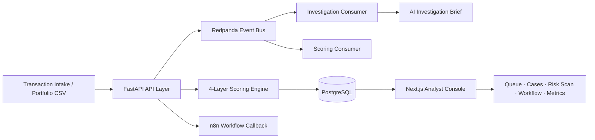

# Real-Time Fraud Intelligence Console

Real-Time Fraud Intelligence Console is a multi-layer fraud scoring, analyst triage, and
AI-assisted investigation platform built on a production-style event-driven architecture.
It combines hybrid ML/rule scoring, behavioural profiling, graph-based mule-network
detection, portfolio-scale risk scanning, lifecycle audit trails, and hardened AI
investigation briefs into a single analyst-in-the-loop fraud decision environment.

The system is validated through controlled synthetic scenarios, benchmark-scale scan
evidence, frontend E2E coverage, and documented governance boundaries.


---

## Demo and Walkthrough

| Surface | Access |
|---|---|
| Frontend Console | http://localhost:3000 |
| 10M Risk Scan Demo | http://localhost:3000/risk-scan?scan_id=aa0971d2-bdb6-49c7-bac3-fa355aa161ad |
| Backend Health | http://localhost:8000/health |
| Detailed Health Check | http://localhost:8000/health/detailed |
| Demo Video Pipeline | [fraud-console/demo/README.md](fraud-console/demo/README.md) |
| Demo Storyboard | [docs/DEMO_STORYBOARD.md](docs/DEMO_STORYBOARD.md) |
| Portfolio Case Study | [docs/PORTFOLIO_CASE_STUDY.md](docs/PORTFOLIO_CASE_STUDY.md) |

**Recommended demo flow:**
Overview &rarr; Dashboard &rarr; 10M Portfolio Risk Scan &rarr; Risk-Tier Filtering &rarr; Paginated Review &rarr; Review Queue &rarr; Case Dossier &rarr; Workflow Events &rarr; Reliability Metrics

Generated demo videos are local artefacts and are intentionally gitignored.

---

## System Summary

Fraud review operations require more than a probability score. A scored transaction
produces a risk signal, but the operational work begins where the model stops: cases must
be prioritised against a live queue, risk evidence must be surfaced in context, analyst
decisions must be formally recorded, and automation workflows must be verified to have
executed as expected. The Fraud Intelligence Console is a fraud decision intelligence
platform that connects all of these layers in a single operational system --
multi-layer scoring, triage, investigation, verdict capture, workflow dispatch, audit,
and reliability monitoring -- with every component reading from and writing to real
PostgreSQL state.

The Portfolio Risk Scan module extends the platform to bulk transaction intelligence.
The async scan engine accepted a 720 MiB synthetic transaction file, processed 10,000,000
rows through bounded-memory chunked ingestion, and persisted every scored result in
PostgreSQL. Indexed composite queries returned paginated analyst review at sub-second
response times through deep pagination. A hardened server-side cursor export streamed
the full 1.64 GiB result set with a 6.987 ms time to first byte and no API restart.

The platform also includes an automated demo generation pipeline: Playwright records
a headed browser walkthrough, Microsoft Edge TTS synthesises a professional voiceover
from the narration script, and FFmpeg merges them into a final narrated MP4 -- fully
automated, locally reproducible, no API key required.

---

## Quantitative Snapshot

| Metric | Verified Result |
|---|---|
| Portfolio Risk Scan benchmark scale | 10,000,000 transactions |
| Processing time | ~103m 35s |
| Average throughput | ~1,610 rows/sec |
| Valid / invalid / skipped | 10,000,000 / 0 / 0 |
| P1 High priority count | 8,420,051 |
| P3 Low priority count | 1,579,949 |
| Total synthetic exposure | $25,095,000,000 |
| Export file | 1.64 GiB, 10,000,001 lines |
| API RestartCount after export | 0 |
| OOMKilled | false |
| Retained benchmark result rows | 22,752,000 |
| E2E Playwright checks | 11 / 11 passed |
| Detailed health endpoint | GET /health/detailed -- all components healthy |
| Demo media pipeline | Playwright + Edge TTS + FFmpeg |
| Docker Compose services | 7 |
| Frontend routes | 8 |
| Backend API endpoints | 27 |

---

## Intelligence Layers

The platform implements four independently-scored intelligence layers that combine into
a single bounded risk score. Each layer maps directly to analyst-visible reason codes
displayed in the Case Dossier.

### 4-Layer Scoring Architecture

```
risk_score = clip(
    base_score
  + rich_boost
  + behavioural_boost
  + graph_boost,
  upper=1.0
)
```

| Layer | Source | Reason code family |
|---|---|---|
| `base_score` | Hybrid XGBoost + deterministic rule: `0.6 x model_output + 0.4 x rule_flag` | High amount, unusual time, high-risk payment method, merchant, region, international, no device ID |
| `rich_boost` | Enriched transaction risk signals from expanded feature context | Multi-field risk combinations beyond the 9-feature base vector |
| `behavioural_boost` | Deviation from entity-level behavioural norms | `BEHAVIOURAL_AMOUNT_DEVIATION`, `BEHAVIOURAL_VELOCITY_DEVIATION`, `BEHAVIOURAL_PROFILE_SHIFT` |
| `graph_boost` | Mule-network topology: shared device/identity clusters, fan-in and fan-out patterns | `MULE_FAN_IN_PATTERN`, `MULE_FAN_OUT_PATTERN`, graph connectivity indicators |

Final clipping preserves bounded score semantics (range: 0.0 to 1.0). Each layer
contributes independently -- a transaction flagged only by graph topology can reach
REVIEW or BLOCK tier without triggering behavioural or rule signals.

### Behavioural Intelligence (Phase 13)

The behavioural layer profiles entity-level transaction norms and detects deviations
that are invisible to static rules:

- **Amount deviation:** transaction significantly exceeds the entity's historical spend baseline
- **Velocity deviation:** transaction rate exceeds expected frequency norms for the entity
- **Profile shift:** combined deviation signals a coordinated change in entity behaviour

Behavioural signals surface as amber chips in the Case Dossier alongside standard rule
and model signals.

### Graph / Mule-Network Intelligence (Phase 15)

The graph layer detects coordinated fraud patterns through shared-entity topology:

- 9 graph indicators per transaction: device sharing, identity cluster membership, fan-in / fan-out patterns
- `MULE_FAN_IN_PATTERN`: transactions converging on a common receiving entity (mule account pattern)
- `MULE_FAN_OUT_PATTERN`: transactions dispersing from a single originating entity (distribution pattern)
- `graph_boost` contributes to the 4-layer risk score independently of model and behavioural signals

Graph signals surface as violet chips in the Case Dossier.

### Adversarial Synthetic Fraud Simulation (Phase 16)

The adversarial simulation phase validates detection coverage across five coordinated
fraud pattern families: velocity manipulation, amount structuring, geographic dispersion,
device rotation, and mule-network coordination. Detection evidence matrices confirm the
4-layer scoring engine identifies adversarial patterns that evade the base hybrid model
alone. Simulation design is documented in
[docs/ADVERSARIAL_FRAUD_DESIGN.md](docs/ADVERSARIAL_FRAUD_DESIGN.md).

### Case Dossier 2.0 (Phase 17) and Model Attribution (Phase 20H)

The Case Dossier workspace organises all risk evidence, investigation context, and
analyst actions into a structured lifecycle view:

- Grouped evidence display: base signals, enriched signals, behavioural indicators, and
  graph indicators in distinct sections
- Lifecycle timeline: creation, investigation, verdict, and workflow dispatch events
  with timestamps
- Score summary with per-layer contribution and reason codes
- **Model Attribution panel**: per-case XGBoost feature contributions computed via
  `GET /cases/{case_id}/explain` using XGBoost's built-in TreeSHAP (`pred_contribs=True`).
  All 9 baseline model features ranked by contribution magnitude. Separates base ML model
  attribution from the 4-layer hybrid reason codes.
- Full analyst verdict capture integrated with workflow dispatch

### AI Investigation Brief Hardening (Phase 18)

The AI investigation pipeline produces per-case briefs with production-grade
reliability controls:

- Evidence-grouped prompting: evidence delivered to the LLM in the same taxonomy
  displayed in the Case Dossier
- `AGENT_VERSION` traceability: every investigation record is tagged with the agent
  configuration version, creating an immutable AI audit trail
- Bounded failure messages: Ollama connectivity failures, LLM content failures, and
  unexpected errors each produce a specific, analyst-readable message rather than a
  raw error or silent failure
- Honest no-guidance handling: when no matching playbook document exists, the prompt
  explicitly states this rather than allowing confabulation
- FAILED-state persistence: investigation failures write a durable FAILED record to
  PostgreSQL; the analyst can retry from the Case Dossier UI

---

## Technology Stack

| Layer | Technologies |
|---|---|
| Frontend | Next.js 16, React 19, TypeScript, Tailwind CSS, TanStack Query, Recharts |
| Backend API | FastAPI, Pydantic, Uvicorn |
| Persistence | PostgreSQL 16, SQLAlchemy ORM, Alembic migrations |
| Eventing | Redpanda (Kafka-compatible), topic-based async stream, kafka-python consumers |
| Cache | Redis 7 |
| Scoring | XGBoost 3.0+, scikit-learn, 4-layer fraud scoring engine (base, rich, behavioural, graph) |
| AI Investigation | Ollama, evidence-grouped prompting, AGENT_VERSION traceability, bounded failure handling, structured report persistence |
| Workflow Automation | n8n, webhook dispatch, HTTP callback audit pattern |
| Demo and Testing | Playwright, Microsoft Edge TTS, FFmpeg |
| Runtime | Docker Compose (7 services) |

---

## Business Problem

Fraud teams do not only need a model score. They need priority-ordered case queues,
explainable risk evidence, AI investigation context, structured verdict capture, and a
workflow layer that proves automation executed and records when it did not. The
operational gap is between model output and decision workflow. A score in isolation is
not an operationally complete output.

Portfolio-scale transaction intelligence adds a second class of problem: bulk transaction
files cannot be scored synchronously without blocking normal case operations. Export of
large result sets fails if the export path reads the full dataset into memory. Deep
pagination degrades without composite index support at multi-million-row scale.

Static rule-based scoring underperforms against coordinated fraud patterns. Behavioural
deviation, mule-network topology, and adversarial structuring attacks require intelligence
layers that profile entity norms and network relationships, not just individual
transaction features.

---

## System Objective

- Score and classify transaction risk using a 4-layer intelligence engine: hybrid ML/rule
  base, enriched signals, behavioural profiling, and graph mule-network detection.
- Convert high-risk records into analyst-reviewable cases with AI investigation briefs.
- Scan large transaction portfolios asynchronously with bounded ingestion and indexed results.
- Preserve every workflow event through a queryable audit trail and reliability monitoring surface.
- Support analyst-in-the-loop decision workflows: AI assists, analysts decide, every
  decision is traceable.

---

## Product Value

| Capability | Operational Value |
|---|---|
| 4-Layer Fraud Scoring | Base ML/rule + rich signals + behavioural profiling + graph topology, each contributing independently to a bounded risk score |
| Behavioural Intelligence | Entity-level deviation detection: amount, velocity, and profile shift -- invisible to static rules alone |
| Graph Mule-Network Detection | Fan-in / fan-out pattern detection across shared device and identity clusters -- identifies coordinated fraud rings |
| Portfolio Risk Scan | Asynchronously score millions of transactions; results persist, page, and export at scale |
| Risk-Tier Filtering | P1/P3 tier filters run server-side against indexed queries; near-instant at 10M rows |
| Indexed Server-Side Pagination | Composite ordered indexes; deep pagination (page 1,000) returns at 0.379s on 10M result set |
| Promote-to-Case | Individual scan results promote to full Case Dossiers, connecting bulk scan and single-case review |
| Analyst Queue | Priority-ordered queue with P0--P3 tier labels, risk score bars, and surgical status filters |
| Case Dossier 2.0 | Grouped evidence display, lifecycle timeline, score summary, model attribution panel, verdict capture, and case-scoped workflow audit |
| Model Attribution | Per-case XGBoost feature contributions (TreeSHAP via `GET /cases/{id}/explain`) ranked by magnitude; separates base ML model attribution from hybrid reason codes |
| AI Investigation Brief | Evidence-grouped prompting, AGENT_VERSION traceability, bounded failure handling, structured LLM report persisted per case |
| Workflow Events | Every automation dispatch and callback produces a durable, queryable audit event with case linkage |
| Reliability Metrics | Health verdict (Healthy / Degraded / Critical) computed from actual event records; SLO-style targets |
| Automated Demo Pipeline | Playwright recording + Edge TTS narration + FFmpeg merge -- reproducible narrated demo artefacts |

---

## Product Architecture



**FastAPI** orchestrates API request handling, async scan jobs, and workflow dispatch.
**PostgreSQL** persists scan jobs, result rows, cases, investigations, verdicts, and all workflow state.
**Redpanda** supports event-driven transaction scoring and investigation triggering.
**Consumers** handle scoring and AI investigation workflows asynchronously.
**Next.js** exposes the analyst review queue, case dossiers, risk scan surface, workflow audit trail, and reliability center.

### Runtime transaction flow

```
Transaction submitted
  -> POST /predict -> Redpanda (transactions.raw)
  -> Scoring Consumer: feature engineering + 4-layer scoring (base + rich + behavioural + graph)
  -> PostgreSQL: prediction + case record
  -> Review Queue (/queue) -> Case Dossier (/cases/[id])
  -> AI Investigation: consumer + Ollama -> evidence-grouped brief -> investigation record
  -> Analyst Verdict: POST /review-case/{case_id}
  -> Workflow Dispatch: POST /workflow/notify-case/{case_id} -> n8n
  -> Audit Callback: n8n -> POST /workflow/audit-event
  -> Workflow Events (/workflow/events) -> Reliability Metrics (/workflow/metrics)
```

### Scoring architecture

**Base hybrid formula:**
```
base_score = (0.6 x model_output) + (0.4 x rule_flag)
```

**4-layer extended formula:**
```
risk_score = clip(
    base_score
  + rich_boost
  + behavioural_boost
  + graph_boost,
  upper=1.0
)
```

Model weights are environment-configurable. Decision thresholds: APPROVE below 0.3,
REVIEW 0.3--0.7, BLOCK above 0.7.

Thresholds are validated within the controlled synthetic benchmark and adversarial
simulation environment. Institution-specific deployment would require calibration against
labelled historical fraud outcomes, false-positive cost analysis, model-risk review, and
operational approval workflows.

### 9-feature base risk vector

| Feature | Source |
|---|---|
| `amount` | Transaction amount |
| `is_high_amount` | amount > $1,000 threshold |
| `is_night_transaction` | Hour < 6 or > 22 UTC |
| `is_international` | Explicit boolean field |
| `is_high_risk_payment_method` | credit_card, digital_wallet |
| `is_high_risk_country` | Country outside low-risk whitelist |
| `is_high_risk_merchant_category` | electronics, gaming, travel |
| `has_device_id` | 0 when device_id absent |
| `is_mobile_device` | 1 when device_type is mobile |

---

## AI Investigation Pipeline

The investigation pipeline delivers per-case AI investigation briefs with
production-grade reliability controls and a complete audit trail.

```
Case promoted to investigation
  -> Evidence extraction: deterministic feature breakdown per case
  -> Evidence grouping: base signals, enriched signals, behavioural indicators,
     graph indicators
  -> RAG retrieval: playbook and policy knowledge base queried for matching guidance
  -> Prompt assembly: evidence groups + playbook context + policy context
  -> Ollama reasoning: structured JSON investigation report generated locally
  -> Schema validation: report validated against structured output contract
  -> Bounded failure handling: Ollama failure, content failure, and unexpected errors
     each produce a specific analyst-readable FAILED report (never a silent failure)
  -> Report persistence: COMPLETE or FAILED report written to PostgreSQL
  -> AGENT_VERSION tagged: investigation row records agent configuration version
  -> Analyst review: brief surfaced in Case Dossier; analyst verdict required
     before any operational decision
```

**AI assists investigation briefing. It does not autonomously enforce decisions.**

Every investigation record is tagged with `AGENT_VERSION`, creating an immutable
traceability chain between the analyst brief and the agent configuration that produced
it. FAILED-state persistence ensures every investigation attempt has a durable outcome,
regardless of downstream dependency availability.

---

## Governance Documentation

The governance documentation package covers the production-readiness boundaries,
architecture constraints, and deployment prerequisites for the platform.

| Document | Scope |
|---|---|
| [docs/CONSUMER_DURABILITY.md](docs/CONSUMER_DURABILITY.md) | Offset management, idempotency guarantees, crash scenarios, and production gap matrix for both event consumers |
| [docs/AUTH_RBAC_DESIGN.md](docs/AUTH_RBAC_DESIGN.md) | Three-role RBAC design (Analyst, Senior Analyst, Admin), permission matrix, JWT architecture, and implementation prerequisites |
| [docs/SECURITY_POSTURE.md](docs/SECURITY_POSTURE.md) | Deployment boundary, CORS posture, secrets inventory, audit trail coverage, investigation safety posture, technical debt inventory, and 18 production hardening controls |
| [docs/AI_INVESTIGATION_BRIEF_DESIGN.md](docs/AI_INVESTIGATION_BRIEF_DESIGN.md) | Investigation brief architecture, evidence grouping design, and AI pipeline contract |
| [docs/CASE_DOSSIER_2_DESIGN.md](docs/CASE_DOSSIER_2_DESIGN.md) | Case Dossier 2.0 layout, evidence section taxonomy, and lifecycle timeline design |

These documents define the governance path for institution-specific deployment and are
designed for review by engineering leads, compliance teams, and risk architecture
reviewers.

---

## Product Modules

| Module | Purpose |
|---|---|
| Fraud Intelligence Command Center | Live KPI strip, 6-stage pipeline map, stale case SLA pressure, system status |
| Risk Command Dashboard | Case intelligence stats, decision mix chart, verdict outcomes, workflow health feed |
| Transaction Intake | Guided intake form with scoring inputs, transaction identity, and investigation context |
| Analyst Workbench | Priority-sorted review queue with P0--P3 tiers, score bars, and status filters |
| Portfolio Risk Scan | Async bulk transaction scoring, progress polling, paginated results, tier filters, export |
| Investigation Workspace | Case Dossier 2.0: grouped evidence, lifecycle timeline, AI brief, verdict capture, case-scoped audit trail |
| Automation Audit Trail | Complete workflow event log with audit summary rail, status/source filters, and case linkage |
| Automation Reliability Center | Health verdict, SLO panels, failure spotlight, action and source breakdown charts |
| AI Investigation Layer | Evidence-grouped LLM briefs via Ollama with AGENT_VERSION traceability, bounded failure handling, and structured report persistence |
| Demo Automation | Playwright recording pipeline, Edge TTS narration, FFmpeg narrated video export |

---

## Portfolio Risk Scan Operating Envelope

The Portfolio Risk Scan module is designed around bounded ingestion, persisted results,
indexed review queries, and streaming export paths. This keeps analyst review responsive
while preserving evidence at portfolio scale.

| Area | Verified Behavior |
|---|---|
| Async ingestion | HTTP 202 response with scan_id; background processing in 2,000-row configurable chunks |
| Memory bounding | Chunk-scoped processing; full file content never held in API heap across chunk boundaries |
| Max-row guardrail | RISK_SCAN_MAX_ROWS configurable; raised from 10k to 10M across five scale milestones |
| Dedup mode | RISK_SCAN_ENABLE_IN_MEMORY_DEDUP configurable; benchmark mode for guaranteed-unique IDs |
| Verified scale | 10,000,000 rows COMPLETE; 0 invalid; 0 skipped |
| Indexed pagination | Composite ordered indexes on (scan_id, risk_score DESC, row_number ASC) |
| P1 filter query (8.42M rows) | ~4.188s including paginated count |
| P3 filter query (1.58M rows) | ~0.604s |
| Deep pagination (page 1,000) | ~0.379s |
| Streaming CSV export | Server-side cursor iterator; header emitted immediately; no full in-memory buffer |
| Export time to first byte | ~0.006987s (10M benchmark) |
| Full export duration | ~113.63s (1.64 GiB, 10M benchmark) |
| API RestartCount post-export | 0 |
| OOMKilled | false |
| DB footprint note | Accumulated benchmark scans reached ~19 GiB; cleanup strategy documented in benchmark hygiene plan |

### Scale ramp milestones

| Scale | Status | Key outcome |
|---|---|---|
| 1M | Verified | Baseline throughput established |
| 2.5M | Verified | Postgres table bloat identified and resolved |
| 5M | Verified | Export path hardened from UI pagination to server-side cursor |
| 7.5M | Verified | Composite ordered indexes added for deep pagination |
| 10M | Verified | All hardening confirmed; full benchmark passed |

---

## Engineering Decisions

**4-Layer Scoring Architecture**
The fraud scoring engine combines four independently computed signals: a hybrid ML/rule
base score, enriched transaction risk signals, behavioural deviation from entity norms,
and graph mule-network topology. Each layer contributes a non-negative boost, with the
final score clipped at 1.0 to preserve bounded semantics. This design keeps each
intelligence layer independently testable and maps each layer's output directly to
analyst-visible reason codes.

**Behavioural Intelligence**
The behavioural layer profiles entity-level transaction norms (amount, velocity, profile)
and scores deviations. This detects fraud patterns that evade static rules: a transaction
that is individually unremarkable but deviates sharply from an entity's established
baseline produces a `BEHAVIOURAL_AMOUNT_DEVIATION` or `BEHAVIOURAL_VELOCITY_DEVIATION`
signal that contributes to the risk score.

**Graph / Mule-Network Detection**
The graph layer computes fan-in, fan-out, and shared-entity indicators across the
transaction graph. Mule accounts receiving from many senders (fan-in) or distributing
from a single originator (fan-out) produce graph boost signals. This detects coordinated
fraud rings that are invisible to single-transaction analysis.

**Consumer Durability Asymmetry**
The scoring consumer commits offsets on all handled paths (including unexpected errors)
to ensure forward progress. The investigation consumer withholds the offset on unexpected
errors to allow retry on restart. This asymmetry is intentional and documented in
[docs/CONSUMER_DURABILITY.md](docs/CONSUMER_DURABILITY.md).

**AGENT_VERSION Traceability**
Every AI investigation record written to PostgreSQL includes an `AGENT_VERSION` field.
This creates an immutable link between each analyst brief and the specific agent
configuration that produced it -- a prerequisite for AI audit trails in regulated
financial services environments.

**Async Portfolio Risk Scan**
POST /risk-scan returns HTTP 202 immediately with a public scan UUID. Background
processing writes progress to PostgreSQL after every chunk, making the scan resumable
and observable via status polling without blocking the API.

**Bounded-Memory Ingestion**
Large CSV uploads spool to a temporary file rather than loading into API heap. The
processor iterates in configurable chunks; only the current chunk is live in memory.
This is what kept the API stable through 10,000,000-row scans.

**Indexed Server-Side Pagination**
Composite ordered PostgreSQL indexes make deep pagination and tier-filter queries
cost-bounded at any result table size. Page 1,000 on a 10M result set returns in
0.379s after index hardening.

**Server-Side Streaming CSV Export**
A bounded-batch cursor iterator writes rows directly to the HTTP response without
buffering the full result set. This is what made a 1.64 GiB export possible with
a sub-7ms time to first byte and zero API restarts.

**Running Summary Counters**
Each chunk update increments persistent counter columns rather than recomputing
tier totals across all prior rows. This resolved the O(N^2) summary degradation
exposed at the 500k scale milestone.

**PostgreSQL Persistence**
All scan jobs, result rows, cases, investigations, verdicts, and workflow events persist
in PostgreSQL. The scan result table is the single authority for pagination, filtering,
and export -- the API holds no in-memory result cache.

**Redpanda Eventing**
Event-driven transaction scoring decouples the API from scoring computation.
POST /predict publishes to the Redpanda broker and returns HTTP 202. The scoring
consumer processes events asynchronously. The same pattern handles AI investigation
triggering.

**Playwright Verification**
Playwright tests cover navigation smoke checks, Case Dossier 2.0 full render and analyst
workflow, and the full 10M demo flow (11 checks, headless Chromium). The recording
pipeline captures a headed walkthrough as a video artefact; functional tests and demo
recording are independent paths.

**Edge TTS Demo Narration**
Edge TTS via the edge-tts Python package generates professional AI narration without
an API key requirement. Narration extraction from the markdown script, TTS generation,
and FFmpeg merge are fully automated via npm run demo:edge-narrated.

---

## Resource, Latency, and Reliability Profile

| Metric | Value |
|---|---|
| API memory -- peak during 10M scan | ~915 MiB |
| API memory -- post export | ~216 MiB |
| PostgreSQL -- post 10M export | ~1.88 GiB (result table only) |
| P1 filter query (8.42M rows, 10M scan) | ~4.188s |
| P3 filter query (1.58M rows, 10M scan) | ~0.604s |
| Deep pagination -- page 1,000 (10M scan) | ~0.379s |
| Export TTFB (10M, 1.64 GiB) | ~0.006987s |
| Full export duration (10M, 1.64 GiB) | ~113.63s |
| API RestartCount post-export | 0 |
| OOMKilled | false |
| Demo video duration | ~148.8s |
| E2E Playwright checks | 11 / 11 passed |

This profile captures the controlled benchmark operating envelope used for product
validation and demo readiness.

---

## Validation and Deployment Scope

The system is validated through benchmark-scale synthetic fraud scenarios in a
controlled local product environment. Validation evidence includes a 10M transaction
scan benchmark, 11/11 E2E Playwright checks, frontend TypeScript build, and a
detailed health endpoint (`GET /health/detailed`) confirming per-component operational
status across Postgres, Kafka, and Ollama.

Thresholds are validated within the controlled synthetic benchmark and adversarial
simulation environment. Institution-specific deployment would require calibration against
labelled historical fraud outcomes, false-positive cost analysis, model-risk review, and
operational approval workflows.

The governance documentation package
([docs/CONSUMER_DURABILITY.md](docs/CONSUMER_DURABILITY.md),
[docs/AUTH_RBAC_DESIGN.md](docs/AUTH_RBAC_DESIGN.md),
[docs/SECURITY_POSTURE.md](docs/SECURITY_POSTURE.md))
defines the deployment-readiness boundary and documents the production hardening controls
required before institution-grade operation.

---

## Repository Structure

```
real-time-fraud-triage-system/
├── src/
│   ├── api/              FastAPI endpoints, Pydantic schemas, scan processor
│   ├── features/         Transaction feature engineering, behavioural profiling, graph intelligence
│   ├── models/           XGBoost training and inference
│   ├── rules/            Deterministic fraud rule evaluation
│   ├── triage/           4-layer scoring engine: base, rich, behavioural, graph boost
│   ├── investigation/    AI investigation consumer, evidence grouping, Ollama reasoner, knowledge retrieval
│   └── events/           Redpanda producer, consumer base, event schemas
├── fraud-console/
│   ├── app/              8 route pages (overview, dashboard, queue, intake, cases, workflow, risk-scan)
│   ├── components/       Page-level and shared UI components
│   ├── lib/              Typed API client, TanStack Query hooks, Zod schemas
│   └── demo/             Playwright recording, Edge TTS narration, FFmpeg merge pipeline
├── alembic/              PostgreSQL migration scripts
├── docs/                 Product documentation, governance package, benchmarks, storyboard, case study
├── data/
│   ├── synthetic/        Synthetic training and adversarial simulation dataset
│   └── knowledge/        AI investigation knowledge base documents
├── scripts/              Demo seeding, verification utilities
├── docker-compose.yml    7-service stack definition
└── .env.example          Environment variable reference with documented defaults
```

---

## Run Locally

**Prerequisites:** Docker Desktop, Node.js 18+, Python 3.11+. Ollama on host for AI investigations.

**Model artifact**

`saved_models/fraud_model.pkl` is tracked in this repository. It is a small (≈106 KB), fully
deterministic XGBoost artifact required by the Docker image at runtime — `docker compose build`
copies it into the container. No separate download or training step is needed for a fresh clone.

The artifact is one component of the broader 4-layer hybrid scoring engine. It is not an autonomous
decision system; analyst verdict is required before any operational action.

To rebuild the artifact from source (optional — for retraining or checksum verification):
```
python data/synthetic/generate_transactions.py   # produces data/synthetic/transactions.csv
python -m src.models.train_model                 # produces saved_models/fraud_model.pkl
```

`data/synthetic/transactions.csv` is generated and gitignored. The generator and trainer both use
deterministic seed 42. See [docs/MODEL_CARD.md](docs/MODEL_CARD.md) for the full artifact contract,
feature schema, and checksum.

**Backend**
```
cd C:\ml_projects\real-time-fraud-triage-system
docker compose up -d --build
docker compose ps
curl.exe http://localhost:8000/health
curl.exe http://localhost:8000/health/detailed
```

**Database migrations** (first run or after schema changes)
```
docker compose run --rm api alembic upgrade head
```

**Frontend**
```
cd C:\ml_projects\real-time-fraud-triage-system\fraud-console
npm install
npm run dev
```

Open http://localhost:3000.

**Seed demo data**
```
cd C:\ml_projects\real-time-fraud-triage-system
python scripts/demo_seed.py
```

See [docs/DEMO_STATE.md](docs/DEMO_STATE.md) for canonical case profiles, walkthrough instructions, and reseed procedures.

---

## Quick Demo Flow

With the stack running (`docker compose up -d --build`) and the frontend live (`npm run dev`):

1. Open **http://localhost:3000** (Fraud Intelligence Command Center)
2. Click **Run Demo** — seeds two canonical fraud cases via `POST /demo/seed` and navigates directly to the Case Dossier
3. Inspect the **Case Dossier**: grouped evidence chips (base, rich, behavioural, graph layers), lifecycle timeline, risk score summary
4. Return to **Review Queue** (`/queue`) to see both cases with decision tier labels and risk score bars
5. Open the second case (FALSE_POSITIVE verdict already applied) to inspect the analyst review workflow
6. Navigate to **Workflow Events** (`/workflow/events`) for the automation audit trail
7. Navigate to **Reliability Metrics** (`/workflow/metrics`) for pipeline health

**Without the Run Demo button** (fresh clone, no Docker stack yet):
```
python scripts/demo_seed.py
```
See [docs/DEMO_STATE.md](docs/DEMO_STATE.md) for canonical case profiles and reseed procedures.

---

## Testing and Demo Automation

```
cd C:\ml_projects\real-time-fraud-triage-system\fraud-console

npm run test:e2e          # 11-check Playwright suite (navigation + Case Dossier 2.0 + 10M demo flow)
npm run demo:visual       # Headed browser walkthrough for live review
npm run demo:record       # Record local WebM artefact (MP4 if ffmpeg in PATH)
npm run demo:edge-narrated  # Generate narrated MP4: Edge TTS voiceover + FFmpeg merge
```

`test:e2e` runs headless Chromium against the live stack; all 11 checks cover navigation
correctness, Case Dossier 2.0 full render and analyst workflow, and the 10M scan surface.

`demo:edge-narrated` generates a full narrated product demo locally using Microsoft Edge
TTS (free, no API key required) and FFmpeg. Generated video and audio artefacts are
local-only and intentionally gitignored.

---

## CI and MLOps Readiness

GitHub Actions CI runs on every push and pull request to `master`/`main`:

| Job | Steps |
|---|---|
| `backend-release-readiness` | Python 3.11 compile check, 41-check release readiness validator, model artifact load and checksum verification, investigation smoke checks |
| `frontend-build` | `npm ci`, ESLint, `next build --webpack` (Node.js LTS) |

**What CI does not run:** Docker / PostgreSQL / Redpanda / Redis / Ollama services.
E2E Playwright tests (`npm run test:e2e`, 11 checks) require the full live stack
and are the **local pre-push gate** — run them from `fraud-console/` before every push.

MLOps maturity: **L2+** — release engineering, artifact governance, and CI validation
are implemented. MLflow, feature store, automated retraining, drift monitoring, and
canary deployment are identified enterprise expansion controls, documented in
[docs/MLOPS_READINESS.md](docs/MLOPS_READINESS.md) as the future L3 roadmap.

---

## Key Documents

| Document | Purpose |
|---|---|
| [docs/PORTFOLIO_CASE_STUDY.md](docs/PORTFOLIO_CASE_STUDY.md) | Full system and benchmark narrative for senior technical reviewers |
| [docs/DEMO_STORYBOARD.md](docs/DEMO_STORYBOARD.md) | Scene-by-scene demo guide with narration angles and scope wording |
| [docs/RISK_SCAN_BENCHMARKS.md](docs/RISK_SCAN_BENCHMARKS.md) | Verified 10M benchmark evidence with full metric tables |
| [docs/PRODUCT_STAGES.md](docs/PRODUCT_STAGES.md) | Complete build history, phase completion log, and product roadmap |
| [docs/CONSUMER_DURABILITY.md](docs/CONSUMER_DURABILITY.md) | Consumer offset management, idempotency design, and production gap matrix |
| [docs/AUTH_RBAC_DESIGN.md](docs/AUTH_RBAC_DESIGN.md) | Authentication and RBAC architecture design |
| [docs/SECURITY_POSTURE.md](docs/SECURITY_POSTURE.md) | Security posture, governance boundaries, and production hardening controls |
| [fraud-console/demo/README.md](fraud-console/demo/README.md) | Demo video recording and AI narration pipeline |

---

## Roadmap

| Capability | Phase | Status |
|---|---|---|
| Risk Scan result detail drawer | Phase 12E | Complete |
| Scan history browsing | Phase 12E | Complete |
| Filtered export UX | Phase 12E | Complete |
| Scan report generator | Phase 12E | Complete |
| Schema mapping and data quality layer | Phase 12F | Complete |
| Rich synthetic fraud scenario generator | Phase 12G | Complete |
| Fraud decision engine upgrade (multi-layer scoring) | Phase 13 | Complete |
| Behavioural intelligence layer | Phase 13 | Complete |
| Dirty data and stream resilience | Phase 14 | Complete |
| Graph / mule-network intelligence | Phase 15 | Complete |
| Adversarial synthetic fraud simulation | Phase 16 | Complete |
| Case Dossier 2.0 | Phase 17 | Complete |
| AI investigation brief hardening | Phase 18 | Complete |
| Governance and production readiness documentation | Phase 19 | Complete |
| Deployment / GitHub / portfolio integration | Phase 20 | In Progress |

---

## Engineering Summary

A fraud decision intelligence platform engineered across a 7-service Docker Compose
runtime -- 4-layer event-driven fraud scoring (base ML/rule + rich signals + behavioural
profiling + graph mule-network detection), PostgreSQL persistence, analyst queues with
Case Dossier 2.0, hardened AI investigation briefs with AGENT_VERSION traceability,
workflow automation audit trails, SLO-style reliability monitoring, and a verified
10M-transaction Portfolio Risk Scan benchmark: 103m 35s end-to-end, ~1,610 rows/sec
average throughput, 1.64 GiB streaming export with a 6.987 ms time to first byte,
zero API restarts.

Validated through benchmark-scale synthetic fraud scenarios, adversarial simulation
across five fraud pattern families, controlled behavioural and graph intelligence
verification, and 11/11 E2E Playwright checks. Governed by a formal documentation
package covering consumer durability, auth/RBAC design, and security posture. Designed
with a deployment-readiness boundary and a documented governance path for
institution-specific labelled-outcome calibration, access controls, monitoring, and
operational hardening.

---

## Author

**Ijaz Kakkod**

Machine Learning Systems &nbsp;|&nbsp; Fraud Intelligence &nbsp;|&nbsp; Decision Intelligence &nbsp;|&nbsp; Model Governance
