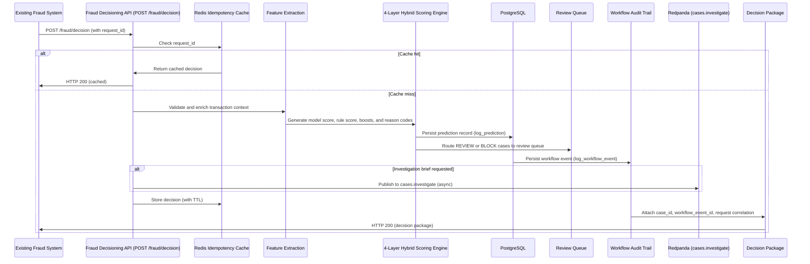

# Integration API Blueprint

**Project:** Real-Time Transaction Fraud Intelligence Console
**Phase:** Phase 20DPLY-B3
**Status:** Blueprint document only. The proposed facade endpoint described in this document is not yet implemented. All referenced internal components (feature extraction, 4-layer scoring, PostgreSQL persistence, workflow event logging) are implemented and operational in the current codebase.

---

## 1. Purpose

This document describes a proposed integration facade that would allow an existing fraud, payments, or risk platform to submit a single transaction event and receive a structured fraud decisioning package in return.

The current codebase exposes a distributed endpoint surface: a caller must coordinate feature enrichment, scoring, case creation, workflow event logging, and optional investigation brief dispatch across multiple endpoints. This is appropriate for analyst-driven product use but creates coordination overhead for machine-to-machine integration.

The proposed facade collapses that coordination into a single, well-defined integration contract:

```
POST /fraud/decision
```

This document defines that contract, the internal orchestration it would invoke, the security controls required before it can be exposed, and a safe implementation roadmap.

---

## 2. Why an Integration Facade Matters

An existing fraud, banking, or payments platform does not want to manage an internal workflow across six API calls to score a transaction and get a decision. It wants to submit a transaction event and receive a decision package. The facade provides that contract while preserving the full intelligence depth of the internal scoring, triage, and audit pipeline.

The facade is an external-facing simplification surface. It maps the existing service boundaries into one decision package without changing the underlying architecture.

Without the facade, machine-to-machine integration requires the caller to:

1. Call POST /predict to score and persist the transaction
2. Parse the response to extract `case_id` and `risk_score`
3. Determine independently whether a workflow event should be logged
4. Optionally call POST /cases/{case_id}/investigate for async investigation
5. Poll GET /cases/{case_id}/investigation if a synchronous brief is needed
6. Assemble the decision context from multiple response objects

The facade handles this orchestration server-side and returns a single, self-contained decision package.

---

## 3. Current State Versus Future Blueprint

| Dimension | Current state | Proposed blueprint |
|---|---|---|
| Integration entry point | POST /predict (scoring) plus separate workflow endpoints | POST /fraud/decision (unified facade) |
| Response completeness | Risk score, decision, reason codes | Full decision package: score, case_id, evidence summary, workflow event ID, request correlation |
| Idempotency | No request_id or idempotency key | Request_id field with Redis-backed deduplication |
| Authentication | None (localhost CORS boundary) | API key or JWT bearer token required before any external exposure |
| Rate limiting | None | Per-client rate limit with burst allowance |
| Observability | Structured logs per endpoint | Request-scoped trace ID; latency metrics by decision tier |
| Investigation brief | Caller must trigger separately | Optional flag in request; async dispatch handled server-side |

---

## 4. Proposed Endpoint

```
POST /fraud/decision
```

**Authentication:** API key or JWT bearer token (required before external exposure; not yet implemented)

**Content-Type:** `application/json`

**Idempotency:** Provide a unique `request_id` per transaction event. If the same `request_id` is received within the idempotency window, the cached decision is returned without re-scoring.

**Response time target (local runtime):** Under 200ms for synchronous scoring path (investigation brief is always async)

---

## 5. Example Request Payload

```json
{
  "transaction_id": "txn_8a3f92cd",
  "amount": 4250.00,
  "timestamp": "2026-06-19T14:32:00Z",
  "payment_method": "credit_card",
  "country": "RU",
  "merchant_category": "electronics",
  "device_id": "dev_7b9e01f4",
  "device_type": "mobile",
  "is_international": true,
  "request_id": "req_c1d2e3f4g5",
  "context": {
    "device_trust_score": 0.22,
    "geo_distance_km": 8400,
    "txn_count_1h": 7,
    "failed_attempts_1h": 5,
    "merchant_risk_score": 0.81,
    "new_payee_flag": false,
    "chargeback_count_90d": 0,
    "avg_transaction_amount_30d": 420.00,
    "customer_avg_amount_30d": 385.00,
    "customer_txn_count_24h_baseline": 2
  },
  "options": {
    "request_investigation_brief": false,
    "source_system": "payments-gateway-v2"
  }
}
```

**Field notes:**

| Field | Required | Description |
|---|---|---|
| transaction_id | Yes | Caller-assigned transaction identifier. Stored in the predictions table. |
| amount | Yes | Transaction amount in the caller's currency. |
| timestamp | Yes | ISO 8601 UTC timestamp of the transaction event. |
| payment_method | No | Used for payment method risk signal (e.g., credit_card, digital_wallet). |
| country | No | Used for country risk signal. |
| merchant_category | No | Used for merchant category risk signal. |
| device_id | No | Device identifier for graph intelligence and device trust signals. |
| device_type | No | Used for mobile device signal. |
| is_international | No | Boolean. If true, country risk signal is applied. |
| request_id | Yes | Caller-assigned idempotency key. Unique per transaction event submission. |
| context | No | Optional block of rich signal fields. Absent fields default to neutral values. |
| options.request_investigation_brief | No | If true, an async investigation brief is dispatched after case creation. |
| options.source_system | No | Source system label, stored in workflow event for audit trail attribution. |

---

## 6. Example Response Payload

```json
{
  "decision": "BLOCK",
  "risk_score": 0.89,
  "model_score": 0.72,
  "rule_score": 1,
  "rich_signal_boost": 0.42,
  "behavioural_boost": 0.09,
  "graph_boost": 0.00,
  "case_id": "3a7f1bc2-4d8e-4f9a-b012-56c7d8e9f012",
  "reason_codes": [
    "High transaction amount",
    "International transaction from elevated-risk region",
    "High-risk payment method",
    "Unrecognised device with low trust score",
    "Geographic location inconsistent with registered address",
    "Transaction velocity exceeds 1-hour baseline",
    "Multiple failed attempts preceding this transaction",
    "High-risk merchant"
  ],
  "evidence_summary": {
    "base_signals": [
      "Amount: 4250.00 (exceeds HIGH_AMOUNT_THRESHOLD of 1000)",
      "Transaction time: 14:32 UTC (daytime; no night-transaction signal)",
      "Model prediction: 1 (XGBoost flagged as suspicious)",
      "Rule flag: 1 (deterministic rule applied)"
    ],
    "rich_signals": [
      "device_trust_score: 0.22 (below 0.40 threshold)",
      "geo_distance_km: 8400 (exceeds 500km threshold)",
      "txn_count_1h: 7 (exceeds 5-transaction velocity threshold)",
      "failed_attempts_1h: 5 (meets 4-attempt threshold)",
      "merchant_risk_score: 0.81 (meets 0.70 threshold)"
    ],
    "behavioural_signals": [
      "amount_deviation_ratio: 11.04 (exceeds 3.0x baseline)"
    ],
    "graph_signals": []
  },
  "recommended_next_action": "BLOCK",
  "investigation_brief_status": "not_requested",
  "workflow_event_id": "wfe_9c1d2e3f",
  "request_id": "req_c1d2e3f4g5",
  "created_at": "2026-06-19T14:32:01.187Z"
}
```

---

## 7. Internal Orchestration Flow

When the facade receives a `POST /fraud/decision` request, it would orchestrate the following sequence internally:

```
1. Parse and validate request body (Pydantic schema)
2. Check idempotency cache (Redis: GET request_id)
   -> If hit: return cached decision package (HTTP 200)
   -> If miss: proceed
3. Assemble transaction DataFrame from request fields
4. generate_basic_features(df)
   -> Extract legacy features (amount, time, device, geography, payment method)
   -> Extract rich signal features from context block (if provided)
   -> Extract behavioural deviation features (if baseline context provided)
   -> Compute graph indicators (if entity fields provided)
5. predict(df) -> model_prediction (XGBoost binary)
6. apply_fraud_rules(df) -> rule_flag
7. triage_decision(df)
   -> base_score = 0.6 * model_prediction + 0.4 * rule_flag
   -> rich_signal_boost (capped via weights)
   -> behavioural_boost (capped at 0.20)
   -> graph_boost (capped at 0.15)
   -> risk_score = (base + boosts).clip(0.0, 1.0)
   -> decision = BLOCK / REVIEW / APPROVE
8. generate_reasons(df) -> reason_codes list
9. log_prediction(db, ...) -> case_id (PostgreSQL INSERT)
10. log_workflow_event(db, ...) -> workflow_event_id (PostgreSQL INSERT)
    -> source_system from request options
11. If decision is REVIEW or BLOCK: place in review queue (already handled by prediction record)
12. If options.request_investigation_brief is true:
    -> Publish to cases.investigate Redpanda topic (async; HTTP 202 semantics)
    -> Set investigation_brief_status: "dispatched"
13. Write idempotency cache (Redis: SET request_id, decision_package, TTL)
14. Assemble and return decision package (HTTP 200)
```

---

## 8. Mermaid Sequence Diagram



---

## 9. Idempotency and Event Tracking

**Idempotency key:** `request_id` (caller-assigned, required field)

**Idempotency behavior:**

| Scenario | Behavior |
|---|---|
| First call with request_id | Score transaction; persist; cache decision; return HTTP 200 |
| Duplicate call within TTL window | Return cached decision without re-scoring; HTTP 200 with `cached: true` flag |
| Duplicate call after TTL expiry | Re-score and create a new case (TTL should be set to exceed the expected maximum processing window for the caller's upstream system) |
| Missing request_id | HTTP 400 Bad Request |

**Recommended Redis TTL:** 24 hours (configurable via environment variable)

**Event tracking fields in every response:**

| Field | Purpose |
|---|---|
| request_id | Echoed from the request; the caller uses this to correlate responses to their own event log |
| case_id | Stable case identifier in PostgreSQL; used for all subsequent case-level API calls |
| workflow_event_id | PostgreSQL workflow event record for audit purposes |
| created_at | Server-assigned UTC timestamp of decision record creation |

---

## 10. Case Creation and Workflow Audit Behavior

**Case creation:** Every call to `POST /fraud/decision` (cache miss) creates a predictions row in PostgreSQL regardless of the decision outcome. APPROVE decisions are persisted: they provide evidence that a transaction was scored and cleared, which is necessary for a complete audit trail.

**Review queue placement:** Predictions with decision `REVIEW` or `BLOCK` are immediately visible in the analyst review queue via the existing `GET /review-queue` endpoint. No additional action is required by the caller.

**Workflow event:** One workflow event is created per scored transaction. The event records:
- Event type: `DECISION_ISSUED`
- Source: value from `options.source_system` (or `API_FACADE` if not provided)
- Status: `SUCCESS` (or `PARTIAL` if investigation brief dispatch failed)
- Case linkage: the new `case_id`

**Investigation brief:** If `options.request_investigation_brief` is `true`, the facade publishes an investigation request to the `cases.investigate` Redpanda topic before returning. The investigation brief is generated asynchronously by the investigation consumer. The caller can poll `GET /cases/{case_id}/investigation` for the result. The facade response includes `investigation_brief_status: "dispatched"` to indicate a brief has been requested.

---

## 11. Error Handling Strategy

| HTTP status | Condition | Action |
|---|---|---|
| 200 OK | Decision issued successfully | Return decision package |
| 400 Bad Request | Missing required fields; invalid field types; malformed JSON | Return error detail; do not score |
| 401 Unauthorized | Missing or invalid bearer token or API key | Return `WWW-Authenticate` header |
| 409 Conflict | Duplicate request_id within TTL (returned only if explicit conflict handling is preferred over transparent idempotency) | Return cached decision with conflict indicator |
| 422 Unprocessable Entity | Request passes JSON parsing but fails Pydantic schema validation | Return field-level validation error detail |
| 500 Internal Server Error | Scoring pipeline failure; unexpected exception | Log with request_id; return error without leaking internal detail |
| 503 Service Unavailable | PostgreSQL unreachable; Redis unreachable | Return 503 with `Retry-After` header |

**Partial failure handling:** If case creation succeeds but workflow event logging fails, the facade returns HTTP 200 with the decision package and sets `workflow_event_id: null` and a `warnings` field. The case is recoverable via the existing audit trail reconciliation path.

**Do not surface internal stack traces:** Error responses must contain a stable `error_code` string and a human-readable `message`, not Python exception details.

---

## 12. Security Requirements

The following controls are required before the facade can be exposed outside the local Docker network. None of these are currently implemented.

| Control | Requirement |
|---|---|
| Authentication | Every request must carry a valid API key or JWT bearer token. See docs/AUTH_RBAC_DESIGN.md for the designed role model. |
| Authorization | The `Integration Service` role (documented in AUTH_RBAC_DESIGN.md) is the appropriate caller role. It has read-write access to the scoring and case creation path and no access to admin or export endpoints. |
| Rate limiting | Per-client rate limit with burst allowance. Recommended starting point: 100 requests per minute per API key, with short-burst allowance of 20 per second. Adjust after load testing. |
| TLS | All traffic over HTTPS. No HTTP-only exposure outside localhost. |
| Input validation | Pydantic schema validation on all request fields. No raw SQL construction from request data. |
| Secret management | JWT signing keys and API key hashes must be injected via a secrets manager, not stored in `.env` files on disk in any shared environment. See docs/SECURITY_POSTURE.md section 4.4. |
| Audit logging | Every request logged with `request_id`, caller identity (from token), decision, risk_score, and latency. Logs must not contain raw transaction PII beyond what is operationally necessary. |
| CORS | In a cloud context, `ALLOWED_ORIGINS` must be set to the specific trusted frontend origin. Wildcard origins are never acceptable when bearer tokens are in use. |

---

## 13. Observability Requirements

| Signal | What to instrument |
|---|---|
| Request latency | Per-decision-tier histogram (BLOCK / REVIEW / APPROVE); p50, p95, p99 |
| Error rate | Count by HTTP status code and error_code; alert on 5xx rate above threshold |
| Decision distribution | Rolling count of BLOCK / REVIEW / APPROVE decisions; sudden distribution shifts may signal upstream data quality issues or scoring misconfiguration |
| Idempotency cache hit rate | High hit rate may indicate caller retry storms; low hit rate is expected in normal operation |
| Score distribution | Histogram of risk_score values; primary signal for detecting score drift over time |
| PostgreSQL write latency | Separate metric for log_prediction and log_workflow_event; slow writes cascade to facade latency |
| Investigation brief dispatch rate | Count of async brief requests relative to total decisions |
| Request correlation | Every log line carries `request_id` and `case_id`; these must be indexed for efficient incident investigation |

---

## 14. Deployment Considerations

The facade is a new endpoint in `src/api/main.py`. It does not require a new service or a new database table. It reuses all existing internal functions.

Deployment prerequisites:

1. Authentication middleware must be implemented and tested before the facade is exposed beyond localhost
2. Rate limiting middleware must be added to the FastAPI application
3. Redis must be confirmed available and healthy before the facade starts accepting traffic (the idempotency cache depends on Redis)
4. The `ALLOWED_ORIGINS` environment variable must be set to the specific trusted caller origin(s) for any cloud deployment
5. The facade endpoint must be excluded from Swagger UI (`include_in_schema=False` or behind auth gate) to prevent unauthenticated discovery in production

The facade does not require changes to the scoring engine, PostgreSQL schema, Redpanda topics, or any consumer. It is a coordination layer over existing components.

---

## 15. Trade-offs

| Trade-off | Analysis |
|---|---|
| Synchronous response vs. async investigation brief | The scoring and case creation path is fast enough for synchronous response (under 200ms on local hardware). The investigation brief is always async because LLM latency is non-deterministic. Separating the two avoids blocking the caller on LLM response time. |
| Single facade vs. granular endpoints | The facade reduces caller coordination complexity but creates a larger, more complex server-side orchestration function. For machine-to-machine integration, the facade trade-off is correct. For analyst-driven product use, the existing granular endpoints remain appropriate. |
| Idempotency window (TTL) | A longer TTL (24 hours) prevents duplicate scoring on retry storms but means that if a genuine re-score is needed within that window, the caller must use a new request_id. This is the correct default for financial transaction processing. |
| Response completeness | Returning all four boost values (rich, behavioural, graph) alongside the final risk_score makes the decision auditable and debuggable at the integration level. It adds payload size but is preferable to opaque scores in a regulated context. |
| Error transparency | Returning granular error codes without stack traces is the correct balance between debuggability and security. Machine-to-machine callers need stable error codes for programmatic handling; they do not need Python exception messages. |

---

## 16. Safe Implementation Roadmap

The following sequence represents the recommended order of implementation. Each step is incremental and independently testable.

| Step | Task | Dependency |
|---|---|---|
| 1 | Add `POST /fraud/decision` route stub to `src/api/main.py`; return a fixed mock response; write an integration test against the stub | None |
| 2 | Wire internal orchestration (feature extraction, scoring, DB persistence) using existing functions; return real decision; add unit tests | Step 1 |
| 3 | Add Redis idempotency check using `request_id`; test with duplicate request submissions | Step 2 |
| 4 | Add request/response logging with `request_id` correlation; verify logs are emitted on both success and error paths | Step 3 |
| 5 | Add Pydantic request validation schema; test with malformed and missing-field payloads | Step 4 |
| 6 | Add authentication middleware (FastAPI `Depends`); implement API key or JWT verification; gate the facade endpoint | Phase 21 auth work |
| 7 | Add rate limiting middleware (e.g., `slowapi`); configure per-client limits | Step 6 |
| 8 | Add latency and decision-distribution metrics instrumentation | Step 7 |
| 9 | Update CORS configuration for cloud deployment target; test from browser and from machine-to-machine caller | Cloud deployment phase |
| 10 | Load test the facade at expected integration traffic levels; confirm PostgreSQL write latency stays within acceptable bounds under concurrent load | Step 9 |

---

## 17. Reviewer Inspection Notes

**What already exists:** Every internal function the facade would call is implemented and operational. `generate_basic_features()`, `predict()`, `apply_fraud_rules()`, `triage_decision()`, `generate_reasons()`, `log_prediction()`, and `log_workflow_event()` are all in production use on the `POST /predict` path. The facade is an orchestration wrapper over these functions.

**What does not yet exist:** The facade endpoint itself, authentication middleware, rate limiting, and the Redis idempotency layer. These are clearly scoped in the implementation roadmap above.

**Where to look:**
| Component | Source reference |
|---|---|
| Feature extraction | `src/features/transaction_features.py` |
| 4-layer scoring formula | `src/triage/investigator.py` |
| Rule engine | `src/rules/fraud_rules.py` |
| PostgreSQL persistence | `src/db/postgres_logger.py` |
| Existing POST /predict path (model for facade) | `src/api/main.py` (line 289) |
| Auth and RBAC design | `docs/AUTH_RBAC_DESIGN.md` |
| Security posture and secrets management | `docs/SECURITY_POSTURE.md` |
| Consumer durability and DLQ gaps | `docs/CONSUMER_DURABILITY.md` |

**Claim-safety note:** This blueprint describes a proposed integration facade. The `POST /fraud/decision` endpoint is not currently implemented. All internal components it would orchestrate are implemented. The blueprint would require authentication, authorization, rate limiting, monitoring, and production secret management before any public or shared exposure.

---

*Document created: Phase 20DPLY-B3 (2026-06-19).*
