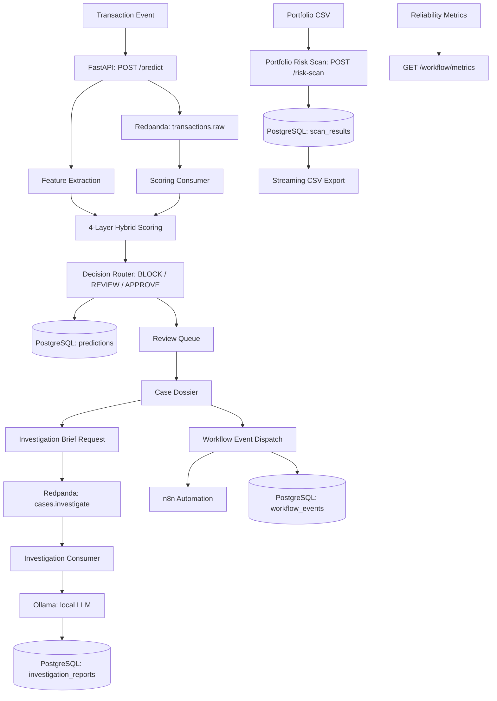

# Real-Time Fraud Intelligence Console: System Snapshot

---

## 1. System Identity

| Property | Value |
|---|---|
| Product name | Real-Time Fraud Intelligence Console |
| Build status | Local development build, not deployed to production |
| Primary runtime | Docker Compose (7 persistent services) |
| Frontend runtime | Next.js 16, port 3000 (runs on host, outside Docker) |
| Backend runtime | FastAPI, Python 3.11+, port 8000 |
| Language stack | Python 3.11+ (backend); TypeScript 5 / Next.js 16 (frontend) |
| Primary data store | PostgreSQL 16 |
| Cache | Redis 7 |
| Event broker | Redpanda (Kafka-compatible, single-node local) |
| Workflow automation | n8n |
| Local LLM | Ollama (host-resident; mistral:latest or equivalent) |
| Release readiness | 41/41 checks PASS |
| E2E test coverage | 11/11 Playwright checks PASS |

---

## 2. Current Implementation Status

| Capability | Status |
|---|---|
| 4-layer hybrid scoring engine | Complete |
| Analyst review queue with priority tiers | Complete |
| Case Dossier 2.0 with grouped evidence | Complete |
| AI investigation brief layer with AGENT_VERSION traceability | Complete |
| Workflow automation audit trail | Complete |
| SLO-style reliability monitoring | Complete |
| Portfolio Risk Scan (10M-row benchmark verified) | Complete |
| Manual transaction intake | Complete |
| Demo automation pipeline (Playwright, Edge TTS, FFmpeg) | Complete |
| Authentication and RBAC | Designed; deferred to Phase 21 (see docs/AUTH_RBAC_DESIGN.md) |
| Cloud deployment | Deferred to Phase 21 (see docs/DEPLOYMENT_PLAN.md) |

---

## 3. Runtime Topology

```
Host machine
  Ollama LLM server       (port 11434)
  Next.js dev server      (port 3000)   [fraud-console/]

Docker Compose network
  api                     (FastAPI, port 8000)
  postgres                (PostgreSQL 16, port 5432)
  redis                   (Redis 7, port 6379)
  redpanda                (Kafka-compatible broker, ports 9092 / 29092 / 8082)
  redpanda-init           (ephemeral: creates required topics, then exits)
  scoring-consumer        (Python 3.11+, consumes transactions.raw)
  investigation-consumer  (Python 3.11+, consumes cases.investigate)
  n8n                     (workflow automation, port 5678)

  Optional (dev profile only):
  redpanda-console        (browser UI, port 8080)
```

Intra-service communication uses the Docker Compose internal network (`redpanda:29092`, `postgres:5432`). External access points: `localhost:3000` (frontend), `localhost:8000` (API), `localhost:5678` (n8n).

---

## 4. Service Inventory

| Service | Image / Runtime | Role |
|---|---|---|
| api | Python 3.11+ / FastAPI | Primary application server: scoring, triage, case management, risk scan, workflow events, health endpoints |
| postgres | postgres:16-alpine | Primary data store: predictions, scan results, investigation reports, workflow events |
| redis | redis:7-alpine | Cache layer for review queue and stats queries |
| redpanda | redpandadata/redpanda:v24.1.1 | Kafka-compatible event broker: transactions.raw and cases.investigate topics |
| redpanda-init | redpandadata/redpanda:v24.1.1 (ephemeral) | Topic bootstrap: creates required topics on first start, then exits |
| scoring-consumer | Python 3.11+ | Reads transactions.raw; runs 4-layer scoring; persists to PostgreSQL |
| investigation-consumer | Python 3.11+ | Reads cases.investigate; calls Ollama; persists InvestigationReport rows with AGENT_VERSION |
| n8n | n8nio/n8n:latest | Workflow automation platform with webhook integration |
| Next.js (host) | Next.js 16 / Node | Frontend: 8 analyst-facing routes, TypeScript |
| Ollama (host) | Ollama | Local LLM inference server |

---

## 5. Core Data Flow



---

## 6. Main Screens and Workflows

| Route | Screen | Key Capabilities |
|---|---|---|
| / | Fraud Intelligence Command Center | Live KPI strip, 6-stage pipeline map, stale case SLA pressure, system status |
| /dashboard | Risk Command Dashboard | Decision mix charts, verdict outcome tracking, case intelligence stats, workflow health feed |
| /intake | Transaction Intake | Guided scoring form: transaction identity, risk signals, scoring context |
| /queue | Analyst Workbench | Priority-sorted review queue (P0-P3 tiers), score bars, status filters |
| /risk-scan | Portfolio Risk Scan | Async bulk scoring, progress polling, paginated results, risk-tier filters, CSV export |
| /cases/[id] | Investigation Workspace | Case Dossier 2.0: grouped evidence, lifecycle timeline, AI brief, verdict capture, case-scoped audit trail |
| /workflow/events | Workflow Events Audit Trail | Complete event log, audit summary rail, status and source filters, case linkage |
| /workflow/metrics | Automation Reliability Center | Health verdict, SLO panels, failure spotlight, action and source breakdown charts |

---

## 7. API and Service Boundaries

**Base URL:** `http://localhost:8000`

**Interactive documentation:** GET /docs (Swagger UI)

| Endpoint group | Representative endpoints |
|---|---|
| Health and status | GET /health, GET /health/detailed |
| Scoring | POST /predict, GET /predictions/{transaction_id} |
| Review queue and case management | GET /review-queue, GET /case/{case_id}, POST /review-case/{case_id} |
| Investigation | GET /cases/{case_id}/investigation, POST /cases/{case_id}/investigate (async, HTTP 202), GET /cases/{case_id}/explain |
| Workflow automation | POST /workflow/audit-event, GET /workflow/events, GET /workflow/metrics, GET /workflow/daily-summary, GET /workflow/stale-cases, POST /workflow/notify-case/{case_id} |
| Portfolio Risk Scan | POST /risk-scan (async, HTTP 202), GET /risk-scan/{scan_id}/status, GET /risk-scan/{scan_id}/summary, GET /risk-scan/{scan_id}/results, GET /risk-scan/{scan_id}/export (streaming), POST /risk-scan/{scan_id}/promote/{result_id} |
| Internal | GET /stats, POST /demo/seed |

Total: 27 endpoints.

---

## 8. Data Persistence Model

**PostgreSQL (primary):**

| Table | Purpose |
|---|---|
| predictions | Scored transaction records: risk_score, decision, feature vector, reason codes, review status |
| portfolio_scan | Scan job registry: scan_id, status, progress, row counts |
| scan_results | Per-row scored results from portfolio scans: risk tier, score, row number |
| investigation_reports | AI brief outputs: recommendation, confidence, risk and mitigating factors, AGENT_VERSION |
| workflow_events | Automation event log: event type, source, status, case linkage, timestamps |

**Redis:** Cache layer for review queue and stats queries.

**Redpanda topics:**
- `transactions.raw`: published by POST /predict; consumed by scoring-consumer
- `cases.investigate`: published by POST /cases/{id}/investigate; consumed by investigation-consumer

**n8n:** Workflow state and trigger history persisted in a named Docker volume (n8n_data).

---

## 9. Scoring and Decisioning Model

**Architecture:** 4-layer additive scoring, bounded to [0.0, 1.0].

**Layer 1: Base score**

```
base_score = MODEL_WEIGHT * model_prediction + RULE_WEIGHT * rule_flag
           = 0.6 * XGBoost_binary + 0.4 * rule_flag
```

XGBoost classifier trained on synthetic transaction data. 9 input features: `amount`, `is_high_amount`, `is_night_transaction`, `is_international`, `is_high_risk_payment_method`, `is_high_risk_country`, `is_high_risk_merchant_category`, `has_device_id`, `is_mobile_device`. Model artifact: `saved_models/fraud_model.pkl`. MD5 checksum locked in release readiness validation.

**Layer 2: Rich signal boost** (additive; up to 9 deterministic signals)

| Signal | Threshold | Boost weight |
|---|---|---|
| is_low_trust_device | device_trust_score < 0.4 | 0.10 |
| is_geo_anomaly | geo_distance_km > 500 | 0.10 |
| is_high_velocity_1h | txn_count_1h > 5 | 0.12 |
| has_failed_attempts | failed_attempts_1h >= 4 | 0.15 |
| is_high_risk_merchant_score | merchant_risk_score >= 0.7 | 0.08 |
| is_new_payee_high_value | new_payee_flag = true AND amount > 500 | 0.15 |
| has_chargebacks | chargeback_count_90d >= 2 | 0.10 |
| is_amount_anomaly | amount > 3 x avg_transaction_amount_30d | 0.08 |
| is_rich_fraud_scenario | scenario_family present and not normal | 0.25 |

**Layer 3: Behavioural boost** (capped at 0.20)

Deviation from entity-level baselines: amount deviation ratio, velocity deviation ratio, balance drop, new device, new country, new counterparty, unusual channel, unusual merchant. Each deviation signal has an independent weight; the total is capped at 0.20.

**Layer 4: Graph boost** (capped at 0.15)

First-slice graph indicators computed across the transaction batch:

| Flag | Meaning | Boost weight |
|---|---|---|
| shared_device_flag | Device shared across 2 or more accounts | 0.05 |
| cross_account_device_reuse | Device shared across different customer entities | 0.07 |
| counterparty_fan_in_flag | Counterparty receives from more than 3 accounts | 0.05 |
| counterparty_fan_out_flag | Account distributes to more than 3 counterparties | 0.05 |

**Final score formula:**

```
risk_score = (base_score + rich_boost + behavioural_boost + graph_boost).clip(0.0, 1.0)
```

**Decision thresholds:**

| Score range | Decision |
|---|---|
| >= 0.7 (BLOCK_THRESHOLD) | BLOCK |
| >= 0.3 (REVIEW_THRESHOLD) | REVIEW |
| < 0.3 | APPROVE |

Thresholds are environment-variable configurable. Each scoring layer emits analyst-visible reason codes. Every scored record stores the full reason code set in PostgreSQL.

**Source references:** `src/triage/investigator.py` (scoring formula, boost dictionaries), `src/features/transaction_features.py` (feature extraction, graph indicators), `src/rules/fraud_rules.py` (rule engine).

---

## 10. Investigation Brief Layer

**Trigger:** POST /cases/{case_id}/investigate (HTTP 202, async)

**Async path:** Request published to `cases.investigate` Redpanda topic; consumed by investigation-consumer; structured prompt assembled and sent to local Ollama instance.

**Evidence groups in prompt:**
- Base signals: transaction amount, time, model flag, rule flag
- Rich signals: device trust, geo anomaly, velocity, failed attempts, merchant risk, payee, chargebacks
- Behavioural signals: amount and velocity deviation, balance drop, new device, new country, new counterparty
- Graph intelligence: shared device, cross-account reuse, fan-in, fan-out
- Scenario context: scenario_family label if present

**LLM output schema (validated on every response):**

| Field | Allowed values |
|---|---|
| recommendation | CONFIRM_FRAUD, FALSE_POSITIVE, ESCALATE |
| confidence | HIGH, MEDIUM, LOW |
| summary | Free-text analyst summary |
| risk_factors | Non-empty list of strings |
| mitigating_factors | Non-empty list of strings |
| recommendation_rationale | Reasoning string |
| confidence_rationale | Reasoning string |

**Resilience design:**
- JSON parse and schema validation on every LLM response
- Retry with previous error appended to prompt (up to 2 retries)
- Connection errors surface gracefully; consumer advances on the next message

**AGENT_VERSION traceability:** Every InvestigationReport row in PostgreSQL stores AGENT_VERSION. This field links each brief to the specific agent configuration that produced it, creating an immutable audit reference for regulated review.

**Governance boundary:** The AI brief is an advisory input. Final case disposition requires explicit analyst verdict submission via POST /review-case/{case_id}. No automated path exists from an LLM recommendation to a BLOCK or APPROVE action.

**Source references:** `src/investigation/reasoner.py` (prompt assembly, Ollama call, retry logic), `src/investigation/consumer.py` (consumer offset strategy), `src/investigation/service.py` (AGENT_VERSION assignment).

---

## 11. Workflow Audit Layer

**Event sources:** POST /workflow/audit-event, POST /workflow/notify-case/{case_id}, internal case lifecycle transitions.

**Storage:** `workflow_events` table in PostgreSQL.

**Frontend surfaces:** /workflow/events (Automation Audit Trail), /workflow/metrics (Automation Reliability Center).

Each workflow event carries: event type, source (manual vs. automated), status, case linkage, and timestamps. The audit trail provides a chronological record of every automation action and manual intervention. Events are written at action time and are not edited after the fact.

**n8n integration:** POST /workflow/notify-case/{case_id} dispatches to the n8n webhook. n8n can execute further automation steps and post callbacks to the API. All resulting events appear in the audit trail.

**Consumer durability asymmetry:** The scoring consumer commits offsets on all handled paths (including error paths) to ensure forward progress. The investigation consumer withholds the offset on unexpected errors to allow retry on restart. Design rationale documented in `docs/CONSUMER_DURABILITY.md`.

---

## 12. Reliability Layer

The Automation Reliability Center (/workflow/metrics) presents:

| Panel | Purpose |
|---|---|
| Health verdict | Derived from aggregate workflow event success rates |
| SLO panels | Automation performance against configurable thresholds |
| Failure spotlight | Recurring failure patterns by event type and source |
| Action breakdown chart | Distribution of automation event types |
| Source breakdown chart | Manual vs. automated event ratio |

The reliability view is populated in both healthy and degraded states. This is a deliberate design choice: a system that surfaces and categorises failures demonstrates stronger operational design than one that shows only green status.

---

## 13. Portfolio Scan Layer

**Trigger:** POST /risk-scan (HTTP 202, async); returns scan_id immediately.

**Ingestion:** Chunked CSV processing (configurable chunk size); no full-file read into API heap.

**Scale benchmark results:**

| Metric | Verified Result |
|---|---|
| Total rows processed | 10,000,000 |
| Processing time | ~103m 35s |
| Average throughput | ~1,610 rows/sec |
| Valid / invalid / skipped | 10,000,000 / 0 / 0 |
| P1 High priority count | 8,420,051 |
| P3 Low priority count | 1,579,949 |
| Total synthetic exposure | $25,095,000,000 |
| Export file | 1.64 GiB, 10,000,001 lines |
| Export time to first byte | ~6.987ms |
| API RestartCount after export | 0 |
| OOMKilled | false |
| Deep pagination (page 1,000) | ~0.379ms |

**Indexed pagination:** Composite ordered indexes on (scan_id, risk_score DESC, row_number ASC).

**Streaming export:** Server-side PostgreSQL cursor iterator; header emitted immediately; no full result set in memory.

**Promotion path:** POST /risk-scan/{scan_id}/promote/{result_id} elevates a scan result row into a full case in the analyst review queue.

---

## 14. Validation Evidence

| Check | Result |
|---|---|
| Release readiness (scripts/verify_release_readiness.py) | 41/41 PASS |
| E2E Playwright checks | 11/11 PASS |
| Next.js lint | PASS |
| Next.js build | PASS (8 routes) |
| Model MD5 checksum | Locked and validated |
| No tracked video artifacts | Confirmed |
| No tracked secrets | Confirmed |
| Stale phrase scan | Clean |

Product screenshots (Playwright-captured): 12 PNGs in `docs/screenshots/` (01-12), covering all primary analyst workflows.

---

## 15. Security Posture

| Control | Status |
|---|---|
| .env and .env.local excluded from git | Validated by release readiness check |
| No credentials in repository | Confirmed |
| Auth and RBAC design documented | docs/AUTH_RBAC_DESIGN.md |
| All LLM inference local (Ollama) | No external LLM API calls |
| PostgreSQL credentials via environment variables | Not hardcoded |
| No web-accessible admin interfaces by default | Redpanda Console requires explicit dev profile activation |

Full posture detail: `docs/SECURITY_POSTURE.md`.

---

## 16. Known Limitations

| Limitation | Notes |
|---|---|
| Authentication not implemented | Design in docs/AUTH_RBAC_DESIGN.md; deferred to Phase 21 |
| Single-node Redpanda | Local dev configuration; not a multi-broker production topology |
| XGBoost trained on synthetic data | No institution-specific calibration; calibration path in docs/MODEL_CARD.md |
| Ollama on host machine | LLM response times depend on model, hardware, and host load |
| n8n workflows locally defined | No production workflow templates included in repository |
| Portfolio scan benchmark input | 720 MiB synthetic CSV; not real transaction data |
| No ingress or TLS | Local runtime; HTTPS not configured |
| SLO thresholds are display-only | No alerting integration in current build |

---

## 17. Deferred Enterprise Controls

| Control | Design Reference |
|---|---|
| Authentication and RBAC | docs/AUTH_RBAC_DESIGN.md |
| Production scoring calibration | docs/MODEL_CARD.md |
| Consumer durability and retry design | docs/CONSUMER_DURABILITY.md |
| Security hardening path | docs/SECURITY_POSTURE.md |
| Cloud deployment and infrastructure | docs/DEPLOYMENT_PLAN.md |

The governance path for each deferred control is documented. These reflect the appropriate boundary between a local inspection package and an institution-specific production deployment. The console is designed for cloud extension: each service boundary maps to a separately scalable deployment unit, and the scoring formula, audit trail, and LLM traceability fields are designed to survive into a production context without architectural rework.

---

## 18. Reviewer Inspection Checklist

| Area | File |
|---|---|
| 4-layer scoring formula and boost dictionaries | src/triage/investigator.py |
| Feature extraction and graph indicators | src/features/transaction_features.py |
| Deterministic rule engine | src/rules/fraud_rules.py |
| Investigation prompt, validation, retry | src/investigation/reasoner.py |
| Investigation consumer offset strategy | src/investigation/consumer.py |
| AGENT_VERSION assignment | src/investigation/service.py |
| All PostgreSQL operations | src/db/postgres_logger.py |
| Chunked ingestion and scan processor | src/risk_scan/processor.py |
| Streaming CSV export | src/api/main.py (GET /risk-scan/{scan_id}/export) |
| Case Dossier 2.0 frontend | fraud-console/app/cases/[id]/page.tsx |
| Portfolio Risk Scan frontend | fraud-console/app/risk-scan/page.tsx |
| Release readiness automation | scripts/verify_release_readiness.py |
| Consumer durability design rationale | docs/CONSUMER_DURABILITY.md |
| Auth and RBAC architecture | docs/AUTH_RBAC_DESIGN.md |

---

*Document created: Phase 20DPLY-B2 (2026-06-19).*
